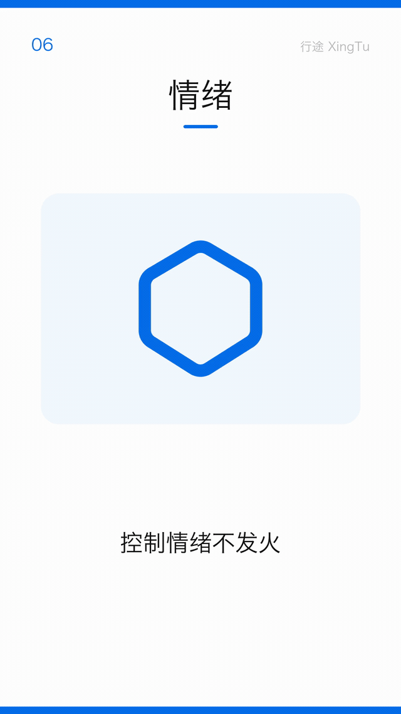
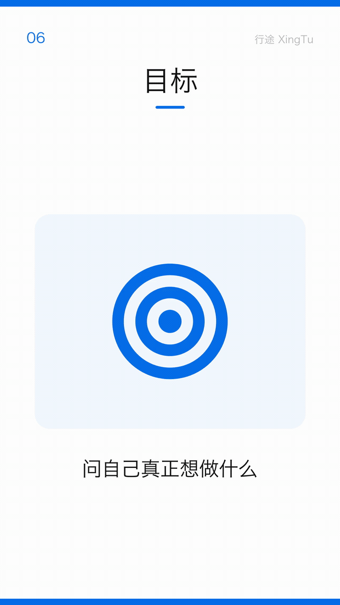
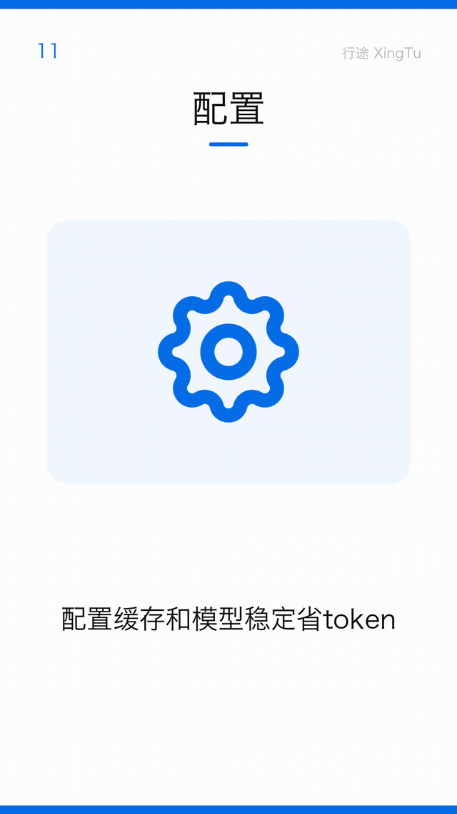
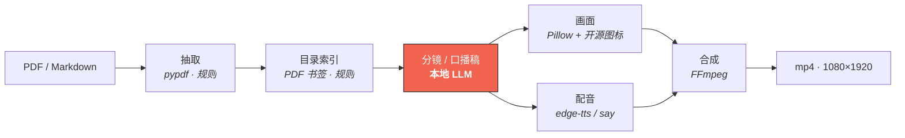

# book2vido · 文本→视频 零成本流水线

[English](README_EN.md) · **简体中文**（本仓文档中文优先，英文版为国际入口自述）

**不要钱，有书，有电脑就行。**

把一本书 / 一篇长文，变成一条**半分钟左右**的竖屏短视频。全程跑在你自己电脑上，不花一分钱。



**→ [看效果 · Demo Gallery](demo/README.md)**（9 条成品片**全部会自动播放** + 3 张产品截图 + 真实命令行输出 + [Slogan 三道门槛拆解](demo/README.md#0--一句话说清楚)）

| 实测区间（不是承诺值） | |
|---|---|
| 单条成片 | **23.1–39.0 s** / **518–708 KB** |
| 单条成本 | **≈¥0.0004**（纯电费） |

每个对外数字的口径见 [`demo/README.md`](demo/README.md) §5。

## 三条演示片（点图看全片 · 带配音）

<table>
<tr>
<td align="center" width="220"><a href="demo/videos/02_拖拽PDF出片.mp4"></a><br><sub><b>① 拖个 PDF 就出片</b><br>23.1s · 518 KB<br>走 <code>.app</code>，零安装</sub></td>
<td align="center" width="220"><a href="demo/videos/03_按章点播_第3章.mp4"></a><br><sub><b>② 348 页只出第 3 章</b><br>36.7s · 670 KB<br>先读目录 → 选章</sub></td>
<td align="center" width="220"><a href="demo/videos/09_自有素材泛化.mp4"></a><br><sub><b>③ 换成自己的素材</b><br>39.0s · 706 KB<br>不限于书，任意长文</sub></td>
</tr>
</table>

> **GitHub 上不会内联播放 mp4** —— `<video>` 标签会被它的 Markdown 清洗器整个剥掉
> （实测：`gh api -X POST /markdown -f mode=gfm` 返回空 `<p>`），点仓库里的 mp4 只给下载按钮。
> 所以上面三张是 **GIF（自动播放）+ 点图进 mp4 文件页**。
> **想"点一下就播、带声音"** → 用仓库自带的本地播放器：`open demo/index.html`。
>
> 全部 9 条 + 3 张截图 + 真实命令行输出：**[看效果 · Demo Gallery](demo/README.md)**

## 一图看完这条链路



**七个环节里只有「分镜」一格用模型**，其余全是可确定的规则代码 ——
这不是洁癖：实测分镜占单条耗时 **65%**，多一格用模型就多一格不可复现、多一格要缓存。
判据与实测见 [`doc/13-确定性与模型分工.html`](doc/13-确定性与模型分工.html)。

## 30 秒：装好就用（macOS）

```bash
bash packaging/build_app.sh          # 产出 dist/Book2Vido.app（约 130 MB）
```

然后**双击图标 = 弹文件选择器**（取消则看说明）；**把 PDF / Markdown 拖到图标上 = 出片**，
处理过程按阶段发系统通知，结果落在 `~/Movies/Book2Vido/`。Python 运行时与 Ollama 随包，
用户**不用装 Python、不用装 Ollama**。

```bash
"dist/Book2Vido.app/Contents/MacOS/Book2Vido" --selftest   # 自检每一项依赖
```

| 事实 | 值 |
|---|---|
| 安装包体积 | **约 130 MB**（2026-09-15 实测 `du -sh dist/Book2Vido.app` = 131 MB；随包运行时一变就变，**引用前先实测**） |
| 模型 | **不内置**（4.9 GB）——首次运行自动下载，并**复用已有的 `~/.ollama/models`** |
| 外部依赖 | `ffmpeg` —— **当前未随包**（homebrew 版绑 18 个 dylib，不可分发；需注入 static build） |

⚠️ **这个包目前还不能交给「没有任何技术背景的人」** —— `vendor/` 里还缺 `ffmpeg`，用户机器上会直接停住（**作者本机有 Homebrew，所以本地永远测不出来**）。构建脚本已加**可分发性门禁**：缺 ffmpeg 时默认拒绝出包并打出 `❌ 不可分发`。这是"一键安装"落地前最后一块，缺口清单与修法见 [`doc/12-交付形态与许可决策.html`](doc/12-交付形态与许可决策.html)。

## 快速开始（开发者）

```bash
# 0) 依赖：本地 LLM 与合成工具链
ollama pull qwen3:8b                 # 本地口播稿模型（M1 16GB 可跑）
brew install ffmpeg librsvg          # librsvg 提供 rsvg-convert，用于渲染图标

# 1) 安装（可编辑安装，之后在项目根即可用 python -m book2vido）
python3 -m venv .venv && source .venv/bin/activate
pip install -e .

# 2) 预热图标缓存（联网一次；跳过也能出片，只是没有图标）
python -m book2vido fetch-icons

# 3) 出片
python -m book2vido run --input ../book2vido/关键对话.pdf --out samples/sample.mp4
```

断网 / 无 `rsvg-convert`：图标层自动降级为「关键词首字大字」版式，**不会中断出片**。

### 想让分镜更好？改提示词，不必改代码

分镜是全链路**唯一**用模型的环节（[`CONSTITUTION.md`](CONSTITUTION.md) 铁律六），
它的行为 100% 由 [`prompts/scriptwriter.md`](prompts/scriptwriter.md) 决定 ——
一份带**逐条注释**的资产：每条约束旁边就写着"为什么这么写、改它会怎样"。

```bash
# 改完先复核：与基准逐字节比对 + 注释有没有剥干净 + 占位符有没有漏
python tests/verify_prompt.py

# 想试另一版又不想动仓库文件 → 在 config.yaml 里指过去：
#   llm: { prompt_file: /path/to/我的实验版.md }
```

**改一个字符就会自动让分镜缓存失效**（缓存键挂的是提示词指纹 —— 不需要记得升版本号），
产物里的 `prompt_version` / `prompt_hash` 记着它出自哪一版。
换模型 / 追 SOTA 的完整流程见 [`doc/15-提示词与模型适配.md`](doc/15-提示词与模型适配.md)。

## 为什么不一样

1. **极致省资源**：画面不烧钱跑文生视频 / 文生图，用**代码生成信息卡 + 开源矢量图标**（成本≈¥0，仅电费）。质量目标＝「能知道文章内容就好」，主动放弃画质军备竞赛。
2. **零公司资源（合规铁律）**：不调用任何公司订阅的 LLM / API key，只用本地模型 + 免费匿名服务。
3. **思想的搬运工（免费 · 不出本机 · 断网跑得完）**：我们只换载体、**不造思想** —— 智能只用在**怎么呈现**（怎么断句、配哪个图标），**不用在"说什么"**（不总结观点、不评论、不改写）。你的书和文章**全程不出本机**。判据是一条命令：`python tests/verify_offline.py --tts say`（**外网请求必须为 0**）。

三条之外还有四条（集百家之长 / MVP 优先 / 克制 / 可读性优先），完整铁律见 [`CONSTITUTION.md`](CONSTITUTION.md)。

## 全链路成本（v2，≈¥0）

| 环节 | 选型 | 成本 |
|------|------|------|
| 文本抽取 | pypdf（本地） | 免费 |
| LLM 口播稿 / 分镜 | Ollama + Qwen3-8B（本地） | 电费 |
| 画面 | Pillow 信息卡 + **Iconify 开源图标**（线描，离线缓存；默认 `ink` 黑红灰，`blue` 为回退） | 免费 |
| 配音 | edge-tts（免费匿名）/ macOS say（完全本地回退） | 免费 |
| 合成 | FFmpeg（本地） | 免费 |
| 发布（可选） | UI-TARS-desktop（开源 GUI Agent） | 免费 |

## 深入阅读

| 想搞清楚 | 去哪看 |
|---|---|
| **想学 AI**（大模型 / 提示词 / 确定性 / 缓存，配图 + 能跑的实验） | ⭐ [`doc/learn/`](doc/learn/) **学习中心** |
| 用哪个模型 · 怎么换 · 换完怎么验 | [`models/README.md`](models/README.md)（**模型台账**） |
| 目录为什么这么分 · 什么东西该进哪个目录 | [`doc/24-目录分区规范.md`](doc/24-目录分区规范.md) |
| 架构 · 扫盲（Ollama 和模型到底谁是谁）· 差异化 · 护城河 | [`doc/16-项目总览.md`](doc/16-项目总览.md) |
| 画面为什么用图标而不是 AI 插画 | [`doc/08-画面资产策略.md`](doc/08-画面资产策略.md) |
| 打包 · 体积账 · `.dmg`/`.pkg`/签名公证对比 | [`doc/09-一键安装与分发.md`](doc/09-一键安装与分发.md) |
| 依赖许可审计 · 协议该怎么选 | [`doc/12-交付形态与许可决策.html`](doc/12-交付形态与许可决策.html) |
| 确定性与模型分工 · 缓存失效键 | [`doc/13-确定性与模型分工.html`](doc/13-确定性与模型分工.html) |
| 画面四代演进实图 | [`doc/14-产物演进史.html`](doc/14-产物演进史.html) |
| 全部文档（**篇数不在此写死**） | [`doc/README.md`](doc/README.md) 总索引 |

**目录结构 / 项目文件树** 见 [`AGENTS.md`](AGENTS.md)；**参与开发前必读错题库** [`doc/lessons/README.md`](doc/lessons/README.md) —— 本项目**同一类缺陷已复发多次**，那份「复发判据速查」就是防它的。

## 项目状态与开源协议

| 项 | 状态 |
|---|---|
| 仓库 | 公开 |
| `LICENSE` | MIT License — Use it, modify it, share it. 署名：行途 / xingtu1996 |
| 不变的部分 | 内容模板 / 工作流 / 宣发 SOP 一律不进本仓库 |

决策选项、依赖许可审计（FFmpeg / edge-tts / 图标集 / 字体的分发义务）与理由：
[`doc/12-交付形态与许可决策.html`](doc/12-交付形态与许可决策.html)。
