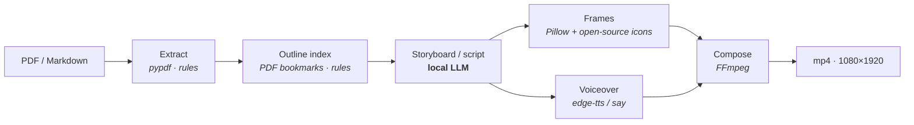

# book2vido · Text-to-Video, Zero-Cost, Local-First

**No money. No cloud. Just a book and a computer.**

> 中文优先：本仓库文档以简体中文为主（SSoT）；本文件是面向国际读者的英文自述。
> 完整论证、看板与踩坑记录都在中文文档里，英文版只做入口。

**book2vido** is a **local-first AI video pipeline**: feed it a book (PDF) or a long article (Markdown),
and it produces a ~30-second vertical short video — entirely on your own machine, for free.


**→ [Demo Gallery](demo/README.md)** (Chinese, but the videos speak for themselves — 9 finished clips, auto-playing GIFs, real command-line output)

| Measured ranges (not promises) | |
|---|---|
| Per clip | **23–39 s** / **518–708 KB** |
| Cost per clip | **≈ ¥0.0004** (electricity only) |

## How it works



**Only one of the seven stages uses a model.** Everything else is deterministic rule-based code —
same input, same output, every time. Measured: the LLM stage is ~65% of total runtime;
each extra model stage would add non-determinism and one more cache to maintain.

## Quick start (macOS, developer)

```bash
ollama pull qwen3:8b        # local scriptwriting model (runs on M1 / 16 GB)
brew install ffmpeg librsvg

python3 -m venv .venv && source .venv/bin/activate
pip install -e .

python -m book2vido fetch-icons                        # one-time icon cache (online)
python -m book2vido run --input book.pdf --out out.mp4
```

Full guide (packaging, model swapping, offline mode) → Chinese `README.md` · `doc/`.

## Why it's different

1. **Extreme resource frugality** — frames are drawn by code (info cards + open-source icon vectors),
   not generated by text-to-video models. Quality goal: "you understand the content",
   not an arms race over image quality. Cost ≈ 0.
2. **Local-first & private** — your book never leaves your machine. The only online touchpoints
   are optional icon fetching and free anonymous TTS; fully offline mode is supported and
   **proven by a test** that asserts **zero outbound requests**.
3. **Carrier, not author** — intelligence is only used for *how to present* (segmentation, icon choice),
   never for *what to say*. No summarizing, no rewriting, no editorializing.

## Design principles (the short list)

- Determinism first: one model stage, three cache layers (a re-run hits cache in ~0.5 s).
- Specs-driven development: every decision and every rejected alternative is on record.
- Readability over performance, except where perf is measured and justified.
- Errors are assets: a lessons-learned index prevents the same mistake twice.

## Status

Works end-to-end on Apple Silicon (M1 Pro / 16 GB). Packaging produces a signed-less `.app` / `.dmg`;
bundling a redistributable `ffmpeg` is the last blocker before it can be handed to non-technical users
(see Chinese `doc/12`). Web UI is planned as the default entry; App Store is explicitly **not** planned.

## License & docs

- Docs in this repo are **Chinese-first**; this file is the English entry point.
- License: see [`LICENSE`](LICENSE).
