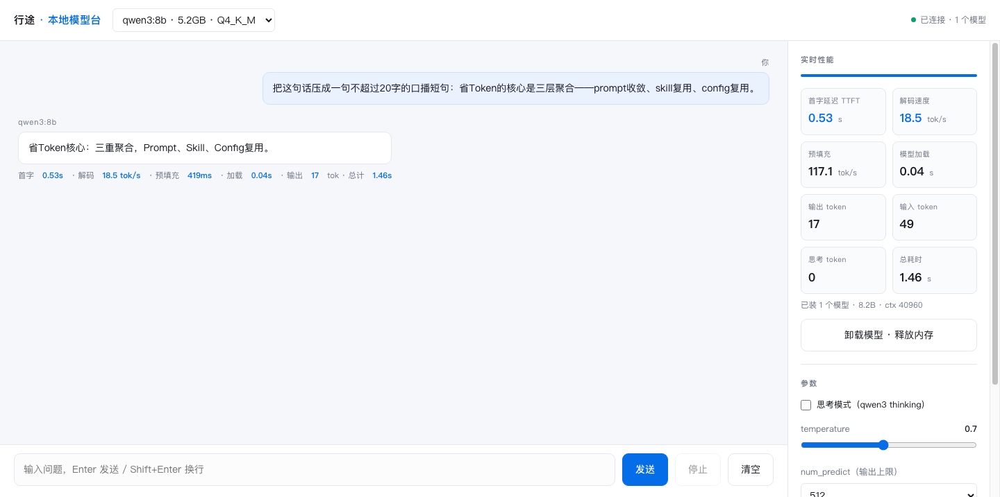
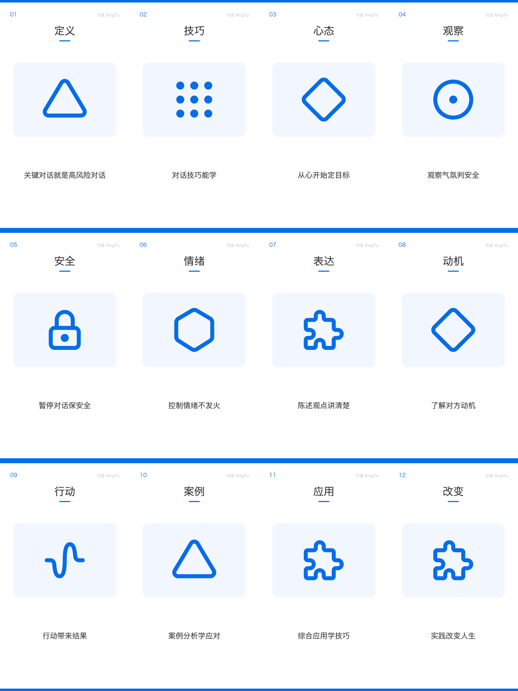
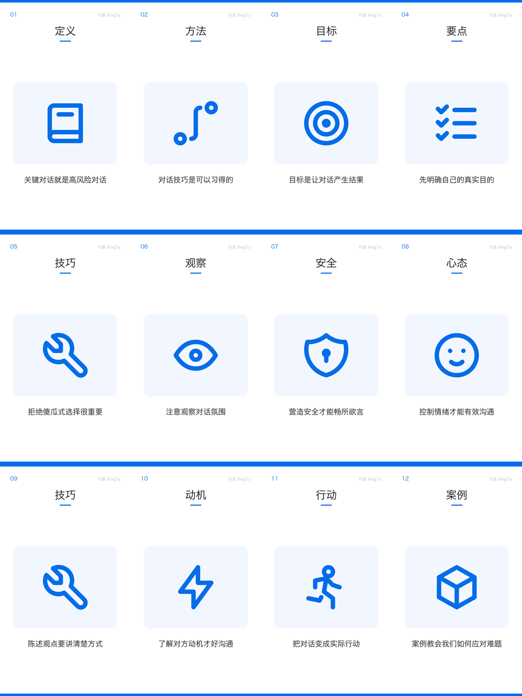

# 看效果 · Demo Gallery

> 不用装任何东西。先看动图，再看完整片。

---

## 0 · 一句话说清楚

**把一本书 / 一篇长文，变成一条半分钟左右的竖屏短视频。全程跑在你自己电脑上，不花一分钱。**

**Slogan：不要钱，有书，有电脑就行。**

这句话不是形容词，是**三道门槛逐个消掉**——每一道都对应一个具体的技术选择：

| slogan 里的词 | 消掉的门槛 | 靠什么做到 |
|---|---|---|
| **不要钱** | 不用买 API / 不用订阅 | 本地 Ollama 出稿 + 免费匿名 TTS，**无任何按次计费**；画面用代码画，不烧文生图 |
| **有书** | 不用先做素材 | 直接吃 `PDF` / `Markdown`；章节树来自**书内书签**（`pdf-outline`），零 LLM 零幻觉 |
| **有电脑就行** | 不用显卡 / 不用服务器 | M1 Pro 16GB 实测可跑（14–17 tok/s）；打包成 `.app` 后连 Python 都不用装 |

> 换句话说：**唯一的前置条件是你手上已经有的东西。**

| 素材 | 输出 | 成本 | 要联网吗 |
|---|---|---|---|
| 一本 PDF 书（348 页） | 一条竖屏短视频（≈0.5–0.7 MB） | 电费（≈¥0.0004/条） | 只在抓图标 / 配音时；模型与合成都本地 |

> 「半分钟」「不到 1MB」都是**实测区间**，不是承诺值。每个数字的口径见 [§5](#5--数字口径对外说的每个数字从哪来)。

---

## 1 · 先看三张动图（GitHub 上会自动播放）

### ① 拖一个 PDF 进去，出来一条片


`关键对话_拖拽版.mp4` · 23.1s · 518 KB · 走 `.app` 随包运行时，用户机器上**不需要装** Python / Ollama / FFmpeg

### ② 348 页的书，只出第 3 章


`t2v_ch03.mp4` · 36.7s · 670 KB · 先读目录 → 选章 → 只算这一章；重跑命中缓存不重算

### ③ 换成自己的素材，一样能出


`省Token实战包装.mp4` · 39.0s · 706 KB · 输入不是书，是自己写的一篇干货笔记

### ④ 产品自述：用它自己，介绍它自己


`产品自述_20260916.mp4` · 31.4s · 670 KB · 输入是一份产品自述（由来 / 定位 / 开发过程 / 技术栈），
**全链路由 Book2Vido 自己跑出来**——本地 Qwen3-8B 写稿、12 张信息卡、31 秒、≈¥0.0006。
这也是「自有素材泛化」的活例子：你给它什么文本，它就把什么变成片。

---

## 2 · 九条成品片（九张全部会自动播放）

> **先把话说明白**：GitHub 的仓库视图**不内联播放 mp4**——`<video>` 标签会被它的 Markdown 清洗器
> 整个剥掉，点 mp4 只给下载按钮（实测记录见 [CHANGELOG](../CHANGELOG.md) T2V-004）。
> 所以**仓库里唯一「打开就动」的形态是 GIF**——下面九张都是，点任意一张进全片文件页。
> 想**带声音看完整片、点一下就播**，用仓库自带的本地画廊：[`demo/index.html`](index.html)。
>
> ⚠️ GIF 自动播放**不是对所有人都成立**：读者若在系统里开了「减少动态效果」，或在 GitHub
> 无障碍设置里关掉了自动播放，他看到的是**静止的第一帧**（外加一个播放按钮）。
> 所以这九张的第一帧都经过**自动挑选**，落在正文卡上而不是空白帧——**静态也读得懂**。

<table>
<tr>
<td align="center" width="180"><a href="videos/01_完整闭环.mp4"></a><br><b>① 完整闭环</b><br><sub>23.3s · 543 KB<br>PDF → 12 张卡 + 配音</sub></td>
<td align="center" width="180"><a href="videos/02_拖拽PDF出片.mp4"></a><br><b>② 拖拽出片</b><br><sub>23.1s · 518 KB<br><code>.app</code> 端到端，零依赖</sub></td>
<td align="center" width="180"><a href="videos/03_按章点播_第3章.mp4"></a><br><b>③ 按章点播</b><br><sub>36.7s · 670 KB<br>348 页里只出第 3 章</sub></td>
</tr>
<tr>
<td align="center" width="180"><a href="videos/04_批量_第1章.mp4"></a><br><b>④ 批量 · 第 1 章</b><br><sub>33.3s · 613 KB<br>一条命令出多章</sub></td>
<td align="center" width="180"><a href="videos/05_批量_第2章.mp4"></a><br><b>⑤ 批量 · 第 2 章</b><br><sub>35.7s · 638 KB<br>与 ④ 同一次命令产出</sub></td>
<td align="center" width="180"><a href="videos/06_快筛_赞誉.mp4"></a><br><b>⑥ 快筛 · 赞誉</b><br><sub>29.3s · 555 KB<br><code>--fast</code> 快约 2 倍</sub></td>
</tr>
<tr>
<td align="center" width="180"><a href="videos/07_快筛_第1版序.mp4"></a><br><b>⑦ 快筛 · 第1版序</b><br><sub>34.0s · 614 KB<br>适合批量初筛</sub></td>
<td align="center" width="180"><a href="videos/08_快筛_前言.mp4"></a><br><b>⑧ 快筛 · 前言</b><br><sub>38.9s · 708 KB</sub></td>
<td align="center" width="180"><a href="videos/09_自有素材泛化.mp4"></a><br><b>⑨ 自有素材</b><br><sub>39.0s · 706 KB<br>不限于书，任意长文</sub></td>
</tr>
</table>

**统一规格**：`1080×1920` 竖屏 / H.264 + AAC / 25–50 fps / 12 句口播。

### 两个容易搞错的编号

「第 3 章」有两套编号，本项目**两套都在用**，写文档时务必标清楚是哪套：

| 编号 | 含义 | 取第 3 章时 |
|---|---|---|
| **目录序号**（CLI 用） | `list` 输出里的第 N 条，**含序言/赞誉等非正文章节** | `--chapter 8`（因为前面有赞誉、两篇序、译者序、前言 5 条） |
| **书内章号**（人话） | 书上印的「第 3 章」 | 就是第 3 章 |

> 实测：`--chapter 3` 拿到的是**第1版序**（p015-p019），不是第 3 章。
> 这条已经踩过，见错题库与 `doc/10-目录索引与按需生成.md`。

---

## 3 · 产品截图

### 本地模型台（零安装网页控制台）



自带流式对话 + 实时性能面板（TTFT / 解码速度 / 显存 / 卸载模型释放内存）。**不联网、不上传**。

### 画面层：修复前 vs 修复后（同一本书）

修复**前**——12 张卡里只有 6 种不同图形（第 10、11 张撞了同一个齿轮图标）：



修复**后**——12/12 语义命中、零重复：



> 这组前后对比留下来，是因为它对应一条真实缺陷：**「有图标率」被当成了「语义命中率」**。
> 病灶与药方见 [`doc/08-画面资产策略.md`](../doc/08-画面资产策略.md)、错题库 [L-01](../doc/lessons/README.md#l-01)。

---

## 4 · 真实命令行与输出

```console
$ book2vido list 关键对话.pdf
目录来源: pdf-outline ｜ 348 页 ｜ 93 条（顶层 22 章）
--------------------------------------------------------
[  1] p010-p012  赞誉
[  2] p013-p014  第2版序
[  3] p015-p019  第1版序
[  4] p020-p022  译者序
[  5] p023-p027  前言
       · p025  本书的新内容
       · p026  未来方向
[  6] p028-p050  第1章 何谓关键对话
       · p031  人们通常是如何应对关键对话的
       · p039  本书的大胆主张
       · p050  小结
[  7] p051-p067  第2章 掌握关键对话
       · p057  对话
       · p064  对话技巧是可以习得的
       · p067  我们的目标
[  8] p068-p092  第3章 从"心"开始 如何确定目标
       · p069  从我做起
       · p072  审视自我的意义
       · p073  从"心"开始
       · p074  真实案例
```
<sub>真实输出（取前 22 行），冷启动 8.3 s。目录来自 PDF 内嵌书签，零 LLM、零幻觉。方括号里的数字就是上面说的**目录序号**。</sub>

```console
# 只出目录第 8 条 = 书里的第 3 章
$ book2vido run --input 关键对话.pdf --chapter 8 --out samples/ch03.mp4

# 一次出多章（--out 视为目录，文件名按目录序号）
$ book2vido run --input 关键对话.pdf --chapters 6,7 --out samples/chapters

# 一个目录里的所有 PDF/MD，各出一条
$ book2vido batch --batch ./我的素材/ --out samples/

# 重跑同一章：命中缓存，不重算
$ book2vido run --input 关键对话.pdf --chapter 3 --out out.mp4
大纲：缓存命中 93 章（读 outline.json，手改生效）
[1/1] 第 3 章「第1版序」p15-p19
    · 分镜：缓存命中 12 句（跳过模型，省 ~36s）
    · 成片：缓存命中 → out.mp4
=== book2vido 成本日志（零公司资源）===
耗时      : 0.0 s
缓存      : hit
单条成本  : ≈ ¥0.0（仅电费）
```
<sub>以上都是**真实输出**。命中缓存时从「跑一遍 90 秒」变成「1 秒内返回」。</sub>

CLI 全部子命令：

| 子命令 | 作用 |
|---|---|
| `outline` | 建目录索引并落盘 `outline.json` |
| `list` | 打印章节树（含页码范围） |
| `run` | 转视频（`--chapter N` / `--chapters 1,3,5` / `--all`） |
| `batch` | **一个目录**下的所有输入，各出一条 |
| `fetch-icons` | 预热关键词图标缓存（联网一次，之后离线可用） |

---

## 5 · 数字口径（对外说的每个数字从哪来）

对外说的每个数字都附实测口径。**它们是区间，不是承诺**：

| 说法 | 实测 | 口径 |
|---|---|---|
| 一条片 ≈ **半分钟左右** | **23.1 – 39.0 s**（上表 9 条） | `ffprobe -show_entries format=duration` |
| 一条片 **不到 1 MB** | **518 – 708 KB** | `ffprobe -show_entries format=size` |
| **零成本** | 本地推理 + 免费匿名 TTS | 无任何按次计费的 API |
| 成本 ≈ **¥0.0004/条** | 电费口径：`30W × 秒数 ÷ 3600 × ¥0.6/kWh`（**整机摊销，非增量；参数为假设值**） | 见 [`doc/01-llm-local.md`](../doc/01-llm-local.md) §**成本口径（电费）** |
| ↑ 它是**花的钱**，不是**省的钱** | 省下的钱＝"本来要付的 API 费"，无客观基准，故不折算 | 同上节「三条边界」 |
| 348 页 → **93 条目录** | 顶层 22 章 + 小节 71 | `book2vido list` 输出 |
| 先生成一遍 **≈ 90 s/章** | 实测 90.2 / 72.8 / 90.4 s | 成本日志「耗时」行 |
| 命中缓存 **< 1 s** | 耗时 0.0 s，墙钟 1.07 s | 同上，`缓存: hit` |

> 为什么把原始说法「30 秒 666kb」改写成区间：实测「666KB」落在区间内，
> 但**「30 秒」只有 4 条里 1 条达标**。对外数字被打脸，损耗的是整条内容的可信度
> ——这条已进错题库 [L-12](../doc/lessons/README.md#l-12) / [L-14](../doc/lessons/README.md#l-14)。

---

## 6 · 素材与版权（诚实披露）

- **图片与视频均为本项目真实产物**，不是效果图。信息卡带 `行途 XingTu` 水印。
- 封面帧是**自动挑选**的：在每条约 45 个时间点采样，取「中部区域非白墨量」最高的一帧
  （避免抽到空白帧或卡与卡之间的交叉淡入）。故封面一定落在某张卡的正文上。
- **九张动图（GIF）的起始时刻用同一个指标挑**：从「最佳帧」前 0.6 s 起切 6 s 循环。
  这样即使读者开了「减少动态效果」、动图停在第一帧，**静止态也是正文卡而不是空白**。
  实测九张 GIF 首帧墨量 0.042–0.071（空白帧为 0.0000–0.0002）。
- **GIF 与 mp4 讲的是同一条片**：GIF 取中段的 6 s 循环，mp4 是 23–39 s 全片（带配音）。
  GIF 只负责「打开就动」，**不是独立产物**。
- **《关键对话》相关样片内容摘自原书**，仅用于**本地/私有**演示。
  ⚠️ **若本仓库将来转为公开，须先把这批样片换成本项目自己的内容**（例如上游素材卡）。
- **两条历史样片未收录进本画廊**（不推荐作 demo，已实测）：
  - `samples/关键对话_ollama.mp4` —— 画面层修复**前**的产物，整帧只有卡片序号与水印，
    标题 / 图标 / 说明全空（中部墨量 0.0000–0.0002，正常片为 0.05–0.07）。
  - `samples/关键对话_sample.mp4` —— 无模型降级路径的早期产物，画面同样稀疏（墨量 0.004–0.010）。
  两条都保留在仓库里作为**历史证据**，但不代表当前画质。

> 这两条最早的片子**不是废料，是档案**——它们和后来几代的对照，正好画出画面
> 「读不了 → 读得懂」的爬升曲线（含中间一次退步）。完整过程与逐代实图见
> **[`doc/14-产物演进史.html`](../doc/14-产物演进史.html)**。

---

## 7 · 相关文档

| 想知道什么 | 去哪看 |
|---|---|
| 怎么跑起来 | [`README.md`](../README.md) · [`HANDOFF.md`](../HANDOFF.md) §0 |
| 为什么这么设计 | [`CONSTITUTION.md`](../CONSTITUTION.md) · [`doc/README.md`](../doc/README.md) |
| 画面是怎么一代代变好的 | [`doc/14-产物演进史.html`](../doc/14-产物演进史.html) · [`doc/assets/evolution/`](../doc/assets/evolution/README.md) |
| 数据会发去哪 | [`SECURITY.md`](../SECURITY.md) |
| 踩过哪些坑 | [`doc/lessons/README.md`](../doc/lessons/README.md) |
| 商业化与协议 | [`doc/11-产品化路线看板.html`](../doc/11-产品化路线看板.html) · [`doc/12-交付形态与许可决策.html`](../doc/12-交付形态与许可决策.html) |
