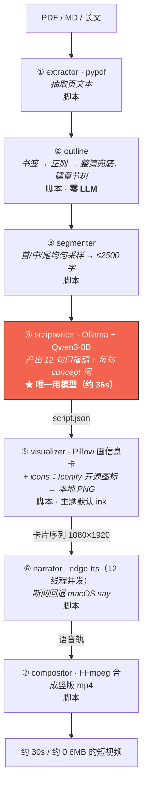

# 16 · 项目总览 —— 扫盲 · 架构 · 理念 · 差异化 · 护城河

> **本文与 README 的分工**：README 是 **30 秒速览**（想快速判断"要不要点进来"）；
> 本文是 **5 分钟纵深**（想搞明白"它到底是怎么搭的、凭什么不一样、能不能抄走"）。
>
> **三类读者各取所需**：
> - 不懂 AI 的人 → 读 [§0 扫盲](#0-扫盲三个最容易混的词ollama--qwen3--模型文件)。这是全项目唯一一处把名词解释清楚的地方。
> - 工程师 / 潜在贡献者 → 读 [§1 架构](#1-架构一条链三层解耦16-个模块) + [§2 理念](#2-设计理念每条铁律各自落在哪一行代码上)。
> - 判断"值不值得关注 / 能不能复用"的人 → 读 [§3 差异化](#3-差异化跟同类比我们哪里不一样) + [§4 护城河](#4-护城河诚实版含纸护城河清单)。

---

## 0 扫盲：三个最容易混的词（Ollama / Qwen3 / 模型文件）

这一节存在的理由：**90% 的"本地 AI 跑不起来"，根因是把这三个词当成了一个东西。**
它们出问题的**表象相似，修法完全不同** —— 分不清就只能瞎试。

### 0.1 一句话讲清

| 词 | 它是什么 | 类比 | 谁提供 | 本项目实际用的 |
|---|---|---|---|---|
| **Ollama** | 本地**模型运行时**：下载权重、加载进内存/GPU、跑推理、对外暴露 HTTP API | **播放器**（如 VLC） | ollama.com（开源，MIT） | Ollama **0.33.2** |
| **Qwen3** | 阿里巴巴通义千问的**第三代开源模型家族**（0.6B / 1.7B / 4B / 8B / 14B / 30B-A3B / 32B …） | **片名系列**（如《星球大战》系列） | 阿里（Apache-2.0） | **Qwen3-8B** |
| **`qwen3:8b`（Ollama 标签）** | 指向一份**具体权重文件**：GGUF 格式、Q4_K_M 量化、**约 5.2 GB** | **具体某一部影片文件** | 由 Ollama 下载到本地 | 落在 `~/.ollama/models` |
| **Q4_K_M（量化）** | 把 16-bit 权重压到约 4-bit：体积与显存降 ~4 倍，质量略降 | **压缩格式**（720p vs 4K） | 打包者预设 | Q4_K_M |
| **「8B」** | 参数量 80 亿（B = billion）。决定能力上限与内存占用 | **影片规格** | — | 8B（14B 会卡） |

**三层依赖关系**（缺一层就报错，且报错文案完全不同）：

```
你的命令
   │
   ├─ ① Python + book2vido        ← 没装 = command not found
   │
   ├─ ② Ollama 服务（:11434）      ← 没起 = connection refused
   │        │
   │        └─ ③ qwen3:8b 权重      ← 没下 = model not found
   │                 │
   │                 └─ ④ 显存/内存够不够 ← 不够 = 卡死 / 被 OOM 杀掉
   └─ ⑤ ffmpeg + rsvg-convert     ← 缺了 = 出不了片（但前四步全绿）
```

### 0.2 为什么要分清：同一句抱怨，三种病因

| 用户会说 | 真实病因 | 该动哪一层 |
|---|---|---|
| 「跑不起来 / 连不上」 | ② Ollama 服务没启动 | 装 / 启动 Ollama |
| 「找不到模型 / model not found」 | ③ 权重没下载 | `ollama pull qwen3:8b` |
| 「第一次特别慢，后面快」 | ③ 冷启动（5.2 GB 加载进 GPU，实测 **4.91s**）+ 闲置 5 分钟后卸载 | 正常现象；保持常驻可避免 |
| 「答得不好 / 句子是碎的」 | **不是 Ollama 的问题** —— 是模型太小，或 `think` 被关了 | 换大模型 / 开 `think` |
| 「很慢」 | 模型太大 → 内存不足换页 | 换小模型 |
| 「输出格式乱七八糟（不是 JSON）」 | **不是运行时的问题** —— 是提示词问题 | 改 `prompts/scriptwriter.md` |

**关键分界**：
- 「连不上 / 找不到」→ **Ollama 层**（运维问题，有确定答案）
- 「答得不好 / 格式乱」→ **模型层 或 提示词层**（质量问题，要实验）

把两者混为一谈，就会出现「答得不好 → 重装 Ollama」这种白费功夫的操作。

### 0.3 一个容易被忽略的坑：同一份权重，换个运行时行为会变

**Qwen3 在 Ollama 里的思考模式（thinking）默认是开的。** 这不是 Qwen3 权重本身的属性，
而是 **Ollama 的模型模板（Modelfile）给它的默认参数**。

后果：同一个 `qwen3:8b`，在 Ollama 跑和在 vLLM / llama.cpp 跑，**默认行为可能不同**；
Ollama 自己升级一版，模板也可能变。

> **这就是 [`config.yaml`](../config.yaml) 里 `llm.think` 必须显式写的原因** ——
> 不写就等于把行为交给一个你看不见的模板，**换运行时/换版本会静默改行为，代码里看不出来**。
> 实测对照见 [`doc/01-llm-local.md`](01-llm-local.md) §think：同一条口播稿，
> `think=true` 36.1s / 568 tok（通顺）vs `think=false` 18.4s / 152 tok（明显变碎）。

### 0.4 本项目里「模型」这个词的三个意思

写文档 / 提 issue 时请指明是哪一层，否则极易答错：

| 说法 | 实际所指 | 例子 |
|---|---|---|
| 「本地模型」 | 常指 **Ollama 运行时**（运维层） | 「本地模型没起」= Ollama 服务没起 |
| 「小模型 / 8B 模型」 | 指 **Qwen3-8B 权重**（能力层） | 「小模型写不好」= 8B 的能力边界 |
| 「用不用模型」 | 指**架构里的分工角色**（设计层） | 「这环节用模型吗」= 有无语义歧义，见铁律六 |

### 0.5 换模型的三种情形（动作完全不同）

| 情形 | 例子 | 要改什么 | 风险 |
|---|---|---|---|
| **同族升参数** | qwen3:8b → qwen3:14b | `config.yaml` 一行 | 内存吃紧（5.9 GB → ~9 GB，16 GB 机器会卡） |
| **换族** | Qwen3 → Llama / Gemma | `config.yaml` 一行 **+ 重跑 `verify_prompt.py`** | ⚠️ 提示词是**按模型调过**的，换族可能整体退化 —— 见 [`doc/15`](15-提示词与模型适配.md) |
| **只调行为** | 开/关 think | `config.yaml` 的 `think`，或 CLI `--fast` | 速度与质量二选一，实测差 2 倍 |

> 三条路都不需要改代码 —— 这是 [`doc/15`](15-提示词与模型适配.md) 的设计目标：
> **模型换代时，改配置与提示词即可，不动 Python。**

---

## 1 架构：一条链、三层解耦

### 1.1 主数据流（7 环节）



<details>
<summary>纯文本版（不渲染 mermaid 的环境看这个）</summary>

```
PDF / MD / 长文
  → ① extractor    pypdf 抽取页文本                       脚本
  → ② outline      书签→正则→整篇兜底，建章节树            脚本（零 LLM）
  → ③ segmenter    按首/中/尾均匀采样 → ≤2500 字           脚本
  → ④ scriptwriter Ollama + Qwen3-8B → 12 句口播 + concept  ★ 唯一用模型（约 36s）
  → ⑤ visualizer   Pillow 画信息卡 + Iconify 图标           脚本（主题默认 ink）
  → ⑥ narrator     edge-tts 12 线程并发，断网回退 say       脚本
  → ⑦ compositor   FFmpeg 合成竖版 mp4                     脚本
  → 约 30s / 约 0.6MB 的短视频
```

</details>

**7 个环节里只有 1 个用模型**（④）。这不是巧合，是 [`CONSTITUTION.md`](../CONSTITUTION.md) 铁律六
的硬约束：**分工判据只看一件事 —— 这一步有没有"歧义"**。
有唯一正确答案 → 脚本（零 LLM、零幻觉、毫秒级）；需要理解语义、做取舍 → 模型。

**②③ 就是这条原则的最佳证据**：目录索引与取料切片听起来"很 AI"，实际全是规则 + 算法，
**零 LLM、零幻觉、毫秒级**（`outline.build` 的 docstring 原话）。

### 1.2 三层解耦（跨平台的关键，也是"分叉只有一条"的原因）

| 层 | 内容 | 换平台要改吗 |
|---|---|---|
| **Python 内核** | 全部业务逻辑（`src/book2vido/`，纯 Python 零平台依赖） | ❌ 不用（纯跨平台） |
| **平台二进制** | Ollama / FFmpeg / rsvg-convert | ✅ 各平台各自的版本（都有官方多平台版） |
| **薄壳** | macOS `.app`（约 130 MB，自检 7/7） | ✅ 各平台各自的壳 |

`binpaths.py` 把二进制路径抽成**独立一层**（原先 4 处硬编码已清掉）。
所以「做全平台要不要重写架构」的答案是：**不要**。
真正的分岔**只有一条**：这一端**有没有本地算力**（→ 见 [`doc/11`](11-产品化路线看板.html) Q2）。

### 1.3 模块按层归位

> 模块数与行数**不在此写死**（必然漂移，本仓库已因此复发三次）——
> 口径永远是 `wc -l src/book2vido/*.py`，依赖方向由 `python tests/verify_deps.py` 守护。

```
入口层    __main__.py        CLI：run / outline / list / batch / fetch-icons
            │
编排层    pipeline.py        只做编排 + 缓存判断 + 进度打印，不实现任何环节
            │                （三个入口：run / run_book / run_chapter）
装配层    providers.py       按 config 造 LLM / TTS / 画面三个 provider → Stage
          config.py          用户 config.yaml 覆盖默认
          binpaths.py        外部二进制定位（ffmpeg / ffprobe / rsvg-convert）
            │
底座层    models.py          ★ 依赖图的塔尖：所有模块依赖它，它不 import 任何同包模块
            │                （Chapter / OutlineDoc / Scene / ScriptDoc / MediaClip）
          concepts.py        ★ 受控概念清单：Scene.concept 的合法值域（领域资产）
          paths.py           ★ 项目根定位的**唯一**来源（原先 5 处各算一遍）
            │
环节层    extractor.py       ① PDF / MD → 页文本
          outline.py         ② 章节树（零 LLM）
          segmenter.py       ③ 章节 → ≤max_chars 的切片
          scriptwriter.py    ④ 口播稿 / 分镜（唯一用模型，可插拔：Ollama | Rule 降级）
          visualizer.py      ⑤ Pillow 信息卡
          icons.py           ⑤ Iconify 图标 → 本地 PNG 缓存（画面资产层）
          narrator.py        ⑥ TTS（edge-tts | say）
          compositor.py      ⑦ FFmpeg 合成
            │
资产层    promptlib.py       ★ 加载 prompts/*.md → 可送模型的文本（注释不计 token）
          cache.py           三层缓存：成片 / 分镜 / 无
          prompts/           提示词资产（分镜行为的唯一来源）
```

**三个值得注意的设计**：

1. **`models.py` / `concepts.py` / `paths.py` 构成底座** —— 三者**只依赖标准库**，
   谁都可以依赖它们，它们不依赖任何同包模块（否则会成环）。
   `concepts.py` 与 `paths.py` 是 2026-09-15 结构整改（档 1）从别的模块里**提升**出来的：
   一个是"被两个消费者共享的数据不该住在其中一个消费者家里"，
   一个是"同一段逻辑抄 5 份、改结构时会静默指错层"。详见
   [`doc/17`](17-结构诊断与重构方案.html) §S-1/§S-2。
2. **`providers.py` 是唯一的装配点** —— LLM / TTS / 画面三者的"造对象"全在一处。
   所以"接三方 API / 用户自带 Key" = **新增一个类 + 一个分支**，上层逻辑一行不改
   （见 [`doc/11`](11-产品化路线看板.html) Q3）。

### 1.4 缓存：按失效条件分层，越贵越上游、键越窄

| 层 | 产物 | 缓存键包含 | 省掉什么 |
|---|---|---|---|
| 成片 | `.mp4` | 全书 hash + 章 + 全部配置 | 整条链路 |
| **分镜（最贵）** | `script.json` | 书 hash + **模型** + **think** + 句数上限 + **正文切片 hash** + **提示词指纹** | **约 36s 的 LLM 调用** |
| 无 | — | — | — |

**「提示词指纹」是本项目一次真实修复**：原先 `script_key` 漏了提示词因子，
导致**改了提示词产出一点没变**（静默命中旧分镜，耗时 0.0s、退出码 0，看起来"成功"）。
现在用**提示词正文的 sha256** 当失效开关 —— 而不是靠人记得升版本号，**因为人一定会忘**。
详见 [`doc/15`](15-提示词与模型适配.md)。

---

## 2 设计理念：每条铁律各自落在哪一行代码上

理念如果不落到代码，就只是口号。**下表每一条都能指到具体文件**（可核）。

> **为什么标题不写"N 条"**：硬编码的计数是必然漂移项 —— 每次增删铁律，所有写了数字的地方都会过期，
> 而**过期的方式是静默的**（没人会去数）。同类坑见 `doc/lessons` 的计数漂移条目。
> 权威清单永远只有一处：[`CONSTITUTION.md`](../CONSTITUTION.md)。**此处不复制它的条数。**

| 铁律 | 一句话 | 落在哪里（可核证据） |
|---|---|---|
| **一 · 零公司资源** | 不调用任何公司订阅的 LLM / API key | 全链路只有本地 Ollama + 免费匿名 edge-tts + 本地 FFmpeg；`SECURITY.md` 威胁模型；AC-15 关键词扫描守门 |
| **二 · 极致省资源** | 不烧钱文生图 / 文生视频 | `visualizer.py` Pillow 代码画卡 + `icons.py` 开源矢量图标；画质目标主动降级为「读得懂」 |
| **三 · 集百家之长** | 不造轮子，优先复用成熟开源 | `doc/01`–`doc/06` 六个选型文档；每个依赖都在 `doc/README.md` 登记 |
| **四 · MVP 优先** | 先跑通闭环再精致 | `specs/` 按 MVP 范围固化；不确定要不要的功能先不做 |
| **五 · 开源与护城河** | 技术拼装不是护城河 | 见 §4 —— 本文把这句判断展开成可检验的评估 |
| **六 · 能用脚本就别用模型** | 有唯一答案 → 脚本 | 7:1 分工（§1.1）；`outline.py` / `segmenter.py` 零 LLM；`think` 显式声明；`script_key` 按因子分层 |
| **七 · 克制** | 根本底牌 = 极致性能压缩 + ¥0 | 外部资产引入三道闸（费用 / 体积 / 替换）；`handraw-style` 216 风格包被否的完整论证见 `doc/08` |
| **八 · 工程的取舍顺序** | 可读性第一，性能例外 | `promptlib.py` 的整行精确匹配（而非省事的子串匹配）＝选可读/正确；`icons.py` 的图标缓存＝选性能，旁边必有注释说明原因；诊断见 [`doc/17`](17-结构诊断与重构方案.html) |
| **九 · 思想的搬运工** | 免费 · 不出本机 · 断网跑得完 | 只换载体不造思想（`scriptwriter.py` 的 `concept` 只能从固定清单选，模型不产出"观点"）；`icons.py` 本地缓存 + 兜底池＝零网络；可执行判据 [`tests/verify_offline.py`](../tests/verify_offline.py)（socket 层拦全部外网，断言请求数 = 0） |

**理念之间是有张力的，这很重要**：
- 铁律三（**优先复用**）和铁律七（**克制**）方向相反 —— 铁律七是刻意补上的**反向闸**。
  只有铁律三，是一条**只能踩油门、不能刹车**的规则：它回答"该不该复用"，没回答"什么时候不该复用"。
- **铁律九是铁律三的第二个反向闸**（铁律七管"要不要引入"，铁律九管"**引入之后拔掉网线还转不转**"）。
  两条一起才把铁律三围起来：**能本地跑 ≠ 免费 ≠ 不出本机** —— 三者是三件事，缺一个都会在
  用户断网 / 谈隐私时露馅。
- 铁律二（**质量主动降级**）和常规产品直觉相反 —— 我们放弃画质军备竞赛，换成本地板。
  这是有意的：质量目标写死为「**能知道文章内容就好**」。
- 铁律八（**可读性第一，性能例外**）把上面所有"取舍"收成一条可判定的顺序：
  先写得让人**能改对**；确有**实测**的效率损失时，用最短的丑换它，并把丑的原因写下来。

---

## 3 差异化：跟同类比，我们哪里不一样

> 竞品数据为 **2026-09-14/15 快照**，星数会变；引用前请重拉。
> 完整清单见 [`doc/07-competitors.md`](07-competitors.md)。

| 项目 | ★（快照） | 路线 | 成本结构 | 能否复用 |
|---|---|---|---|---|
| chatfire-AI/huobao-drama | 15,101 | 全 Agent 全自动短剧 | 烧 Kling / Seedance | ❌ CC BY-NC-SA 禁商用 |
| HKUDS/ViMax | 12,368 | Agentic 视频生成 | 烧云端视频模型 | ⚠️ MIT，架构可参考，视频环仍烧钱 |
| anil-matcha/ai-short-drama | 492 | 多 Agent 管线 | 烧 Kling / Veo | ⚠️ 同质化 |
| EvoLinkAI/ai-short-drama | 36 | 小说转视频 | 自托管模型 | ✅ MIT，轻 |
| lzcjsyr/Book2Video | 6 | PDF→口播→静态图/TTS→FFmpeg | 仍烧图像 API | ⚠️ 思路重合，provider 绑定重 |
| **book2vido（本项目）** | — | 长文 → 口播稿 + 代码画卡 → 免费 TTS → FFmpeg | **纯电费（¥0.0004/条）** | ✅ 私有阶段 |

### 三条结构性差异（不是"我们更好"，是"我们选了另一条路"）

1. **不烧钱 —— 整条链没有一个按量付费的环节。**
   头部全在烧云端视频/图像模型；`Book2Video` 思路最接近，但仍在图像 API 上付费。
   **星数越高越烧钱**，这本身就是这条赛道的结构性事实。

2. **全本地 —— 断网也能出片。**
   唯一需要网络的两个点是**可选的**：首次下模型、图标预热；以及 TTS 的 edge-tts
   （有 `say` 全本地回退）。书稿内容**不出机器**，这是隐私属性，也是合规属性。

3. **确定性优先 —— 7 个环节只有 1 个用模型。**
   多数同类项目把每一环都交给 Agent / 大模型（越"智能"越贵、越不可复现）。
   我们反过来：**能用脚本的高速执行，模型只出现在真正要做判断的地方**。
   副作用是**可复现**：同样的输入 + 同样的缓存，产出逐字节一致。

### 我们主动放弃的（写在明处，别期待）

| 放弃 | 为什么 | 代价 |
|---|---|---|
| 画质军备竞赛 | 换成本地板（¥0 vs 按量付费） | 画面是信息卡，不是插画/视频 |
| 全自动 Agent 编排 | 每个 Agent 环节都是一次付费调用 | 不是"一句话出一个片"，需要人选章 |
| 云端规模 / SaaS | 与在职状态红线直接冲突 | 单人本机运行，无多用户 |
| 情感化配音 | 免费匿名 TTS 的边界 | 机械音 |

---

## 4 护城河：诚实版（含纸护城河清单）

[`CONSTITUTION.md`](../CONSTITUTION.md) 铁律五写过一句判断：

> 「护城河 = 极致省资源方法论 + AI 工程化实践者人设 + 已沉淀素材库，**不在技术拼装本身**。」

本节的任务是**把这句判断变成可检验的评估** —— 哪些是真壁垒，哪些是纸的。

### 4.1 先列「纸护城河」（看起来像壁垒，其实不是）

| 以为的壁垒 | 实际可复制性 | 说明 |
|---|---|---|
| **代码本身** | 🔴 低壁垒 | **2344 行 Python，无自研算法**。任何熟练工程师照文档一周可重写 |
| **架构设计** | 🔴 低壁垒 | 一条线性流水线 + Provider 抽象，是标准工程手法 |
| **图标资产** | 🔴 低壁垒 | Iconify 是公开的，缓存可以重下 |
| **这个 idea** | 🔴 无壁垒 | 「书 → 短视频」是公开赛道，同类项目已 1.5 万星 |

**结论：技术拼装不构成护城河。** 铁律五的判断是对的，而且可以量化 ——
**能一周抄走的东西，就不是壁垒。**

### 4.2 真护城河（三条，按不可复制性排序）

| # | 资产 | 可复制性 | 为什么抄不走 |
|:--:|---|---|---|
| 1 | **极致省资源的方法论** | 🟢 高壁垒 | 它不是代码，是**判断力**：`think` 必须显式声明、7:1 分工判据、缓存键该含哪些因子、什么时候「不该复用」、什么叫「读得懂」的质量档。这些来自几百次真实运行与取舍，**代码可抄，判断抄不走** |
| 2 | **错题库 + 实测数据**（累积型） | 🟢 高壁垒 | [`doc/lessons/`](lessons/README.md) 每条错题都来自真实踩坑（含"改了没生效"这类静默故障）。**累积型资产的时间成本不可压缩** —— 你不可能一周踩完别人三个月的坑 |
| 3 | **内容资产与人设** | 🟢 高壁垒 | 铁律五原话：不在技术拼装里。同一个人 + 同一套方法论 + 持续产出的内容，是唯一无法被"clone 一份仓库"带走的东西 |

### 4.3 为什么「开源」不伤护城河（反直觉，但这正是逻辑自洽的地方）

既然代码是**纸护城河**，那开源它就**不损失真资产**：

- 开源的是 **2344 行可复制的技术拼装** → 换来的可能是被引用、被贡献、被看见。
- **不开源**保住的是**判断力沉淀 + 错题库 + 人设** → 这些本来就不在代码里。
- 所以「引擎开源、产品与品牌资产保留」这个分层，**不是妥协，是按壁垒在哪来切**。

> ⚠️ 但开源**时机**是另一件事，涉及在职状态、许可义务、分发责任 ——
> 完整决策树与四个协议选项见 [`doc/12-交付形态与许可决策.html`](12-交付形态与许可决策.html)。
> 本文只回答「该不该开」，不回答「现在开不开」。

### 4.4 护城河的脆弱点（自我对抗）

诚实地列出来，比假装没有强：

| 脆弱点 | 风险 |
|---|---|
| **免费匿名 TTS（edge-tts）** | 调用微软 Edge 在线服务的非官方公开接口 —— **这是全链最脆弱的一环**（见 `doc/12` §02）。已备 `say` 全本地回退 |
| **8B 模型的能力天花板** | 长章采样导致原文覆盖率低（最差 14.8% 进模型，见 `doc/10` §六），分镜质量受限于此 |
| **单点维护** | 目前 n=1 人维护，无贡献者生态 |
| **平台演进** | macOS 每次大版本升级都可能打断 `.app` |

---

## 5 这张图怎么用

- **想改提示词** → [`doc/15`](15-提示词与模型适配.md)（改完 `python tests/verify_prompt.py` 复核）
- **想加依赖** → [`doc/README.md`](README.md) §四（先过铁律七三道闸，再登记）
- **想知道"这环节该不该上模型"** → [`doc/13-确定性与模型分工.html`](13-确定性与模型分工.html)
- **想参与产品化 / 商业化讨论** → [`doc/11`](11-产品化路线看板.html) + [`doc/12`](12-交付形态与许可决策.html)
- **想找坑（别重复踩）** → [`doc/lessons/README.md`](lessons/README.md)

---

*本文数字口径：`doc/01` §性能实测（Ollama 0.33.2 / qwen3:8b Q4_K_M / M1 Pro 16GB，2026-09-15）；
**模块数与行数不在本文写死**，口径永远是 `wc -l src/book2vido/*.py`（本文只在需要说明
"规模量级"时引用，且不写具体条数——本仓库已因硬编码计数复发过三次漂移）；
竞品星数为 2026-09-14/15 GitHub 快照。凡引用前请复测。*
