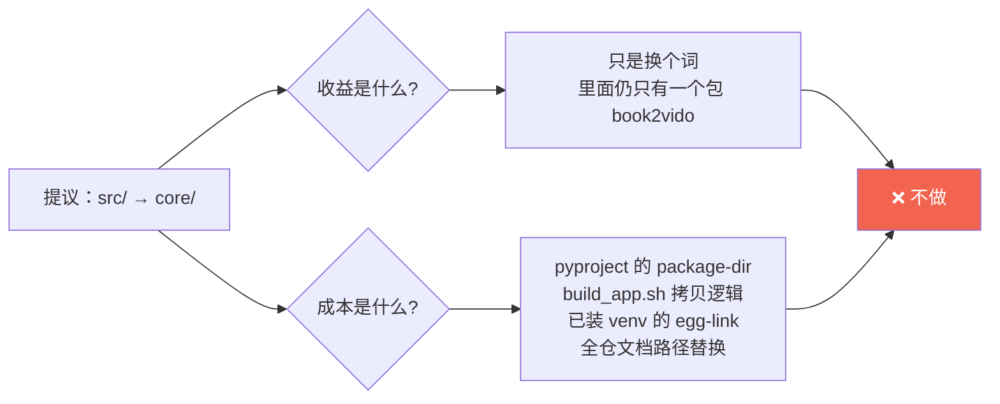
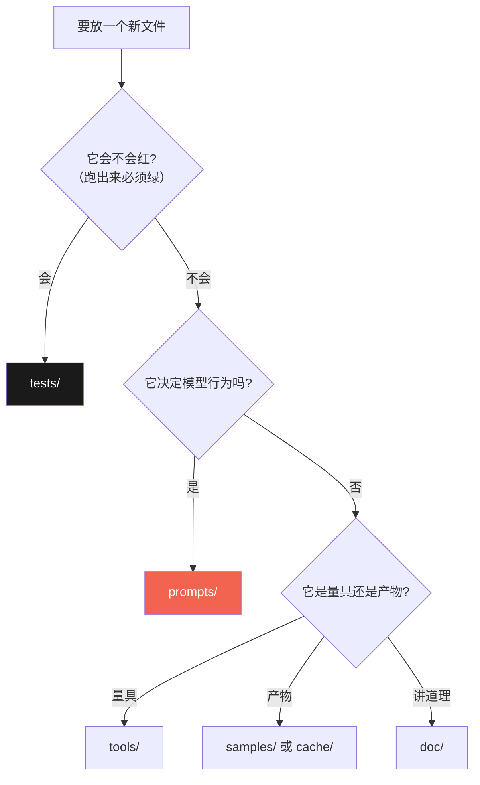

# 24 · 目录分区规范（什么东西该进哪个目录）

> **本文是「目录」这件事的唯一判据。** 新建文件 / 移动文件前先来这儿对一眼。
> 动因：boss 提「项目目录感觉不太一样，是不是该有 core / log 之类的分区」——
> 于是把**每个目录的边界**写下来，而不是靠"看着像就放这儿"。

---

## 一、先说结论：三个真实缺口，两个不改名

| 缺口 | 动作 | 状态 |
|---|---|---|
| **没有日志目录** | 新增 `logs/`（默认不写盘，`--log-file` 显式开） | ✅ 已建 |
| **没有测试目录** | 从 `tools/` 分出 `tests/`（8 个 `verify_*` 迁入） | ✅ 已建 |
| **没有模型管理层** | 新增 `models/`（台账 + 换模型 SOP，**不存权重**） | ✅ 已建 |
| `src/` → `core/` | **❌ 不做**（理由见 §三） | 已裁决 |
| `doc/` → `docs/` | **❌ 不做**（理由见 §三） | 已裁决 |

---

## 二、分区表（这是本文的核心，改目录前先看它）

| 目录 | 放什么 | **不放**什么 | 入库 |
|---|---|---|:-:|
| `src/book2vido/` | 引擎代码，一模块一事 | 提示词 / 测试夹具 | ✅ |
| `prompts/` | 提示词资产（带就近注释 + 版本号） | 代码 | ✅ |
| `models/` | 模型**台账**：用哪个 / 怎么换 / 怎么验 | 模型权重（在 `~/.ollama/models`） | ✅ |
| `tests/` | **会红的断言**（可回归，必须绿） | 一次性探针 | ✅ |
| `tools/` | **量具**：探针 / 基准 / 剖析 / 预览 | 判据 | ✅ |
| `doc/` | 选型 / 决策 / 踩坑 / 学习中心 | 未脱敏内容 | ✅ |
| `doc/learn/` | **教学层**：把已有结论讲成人话 | 新结论（那是 `doc/` 上层） | ✅ |
| `logs/` | 运行日志（**默认不写**） | 产物 / 证据分析 | 部分 |
| `cache/` | 三层缓存（成片 / 分镜 / 大纲） | —— | ❌ |
| `samples/` | 输入与出片 | 受版权书籍（`samples/books/`） | 部分 |
| `demo/` | 对外门面：GIF / mp4 / 截图 / 播放器 | 源文件 | ✅ |
| `specs/` | 每次改动的规格与验收账 | —— | ✅ |
| `packaging/` | 打包脚本 | 产物（`dist/`） | ✅ |
| `assets/` | 图标等静态资源 | 大体积二进制 | ✅ |
| `.backups/` | 改动前备份（回滚用） | —— | ❌ |

**判据一句话**：这个目录里**会不会红** —— 会红的是 `tests/`，会量的是 `tools/`，
会讲道理的是 `doc/`，会变的资产单独成目录（`prompts/` `models/`）。

---

## 三、为什么 `src/` 不改名成 `core/`

| 角度 | 说明 |
|---|---|
| **生态惯例** | Python 的 `src/` 布局（src-layout）是 setuptools 官方推荐形态，`core/` 是 Java / Go 的习惯。改名 = 主动脱离生态，工具（pytest / mypy / pyright 的默认配置）成本上升 |
| **语义** | `core/` 的价值在于**和别的东西区分**（core vs plugin vs adapter）。本仓库 `src/` 下只有一个包，没有"非核心代码"要区分出去 —— **没有对比项的名字是空的** |
| **已论证过** | [`17-结构诊断与重构方案.html`](17-结构诊断与重构方案.html) 里提到的 `core/` 指的是**按性质分目录**（`core/` `stages/` `support/`）另一回事，且那是"档 2/档 3"，当时结论是**不做** |
| **真实风险** | `paths.py` 用 `parents[2]` 定位项目根（同深度改名其实安全），但 `build_app.sh` / `pyproject` / 已安装 venv 三处是**静默**的 —— 测不出来，只会在某次打包时才炸 |

> **结论**：目录的**价值在边界清晰，不在名字好听**。边界已经用 §二 的分区表写清楚了，
> 改名不增加任何清晰度，只增加三处静默风险。

---

## 四、为什么 `doc/` 不改名成 `docs/`

同样是成本收益问题：`doc/` 在 README / AGENTS / HANDOFF / demo / doc 内部**有几十处链接**，
改名要全量替换，收益是"更常见"。**不值得**。
（如果哪天要大改，顺手做；不为它单独开一次改动。）

---

## 五、`tests/` 与 `tools/` 的分界（最容易搞混的一条）

| | `tests/` | `tools/` |
|---|---|---|
| 性质 | **判据**（会红） | **量具**（会量） |
| 红了意味着 | 不该合入 | "知道了"，不是坏了 |
| 跑的时机 | 改动后 / 发布前 | 想量一下的时候 |
| 依赖 | 纯标准库优先（守护不该有依赖） | 可以有第三方 |
| 例子 | `verify_deps` `verify_offline` | `probe_outline` `bench_ollama` `profile_pipeline` |

> 曾经的代价：8 个 `verify_*` 和 6 个 `probe_*` 混在一个 `tools/` 里，
> **没人说得清哪些是必须跑绿的** → 结果就是都不跑。
> 分开之后这条界线是**目录名本身**，不需要记。

---

## 六、新增文件时的三步自问

---

## 七、本文的维护

- **新增顶层目录** → 回来加一行到 §二 的分区表（**目录的存在本身要被登记**）。
- 改了 §三 / §四 的裁决 → 说明新的理由（**裁决要留反方意见**，否则后人不知道当时权衡了什么）。
- 本文**不写死任何计数**（N 个模块 / N 篇文档）—— 计数型数字必然漂移，见错题库 L-12 / L-14。

---

## 相关

- 为什么这样分、AI 项目多出来的三个麻烦（教学版）：[`learn/01-AI项目工程化.md`](learn/01-AI项目工程化.md)
- 结构诊断与三档重构方案：[`17-结构诊断与重构方案.html`](17-结构诊断与重构方案.html)
- 依赖方向守护（动目录后必跑）：[`../tests/README.md`](../tests/README.md)
- 模型台账：[`../models/README.md`](../models/README.md)
