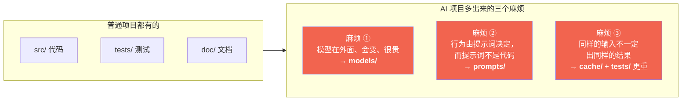
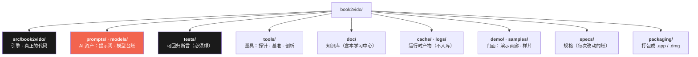

# 01 · AI 项目长什么样（先认路，再动手）

> 学完你能回答：**为什么一个 AI 项目要分成这么多目录？跟写个普通脚本差在哪？**
> 跑一条命令感受一下：`find . -maxdepth 1 -type d | sort`

---

## 一、一句话：AI 项目 = 普通项目 + 三个新麻烦

普通项目的目录是为「代码」服务的。AI 项目多出来的三个东西，每一个都逼出一个新目录：

| 麻烦 | 具体表现 | 逼出来的做法 |
|---|---|---|
| **模型在外面** | 4.9 GB 的权重不在仓库里，换一个模型行为全变，还可能没装 | 单独一个 **`models/`** 台账：记录用哪个、怎么换、换完怎么验 |
| **提示词不是代码** | 它决定模型行为，但改它不该走代码评审，也不该混在字符串里 | 单独一个 **`prompts/`**，带版本号、带就近注释、有指纹 |
| **不确定** | 同样输入两次可能得到两版分镜 → 缓存键、可复现性全成问题 | **`cache/`** 分层 + **`tests/`** 里必须有"确定性守护" |

---

## 二、本仓库的分区（一张图认全）

逐条说明（**每个目录一句话，说清"什么该放进来"**）：

| 目录 | 放什么 | 不放什么 | 入库? |
|---|---|---|---|
| `src/book2vido/` | 引擎代码，一个模块一件事 | 提示词、测试数据 | ✅ |
| `prompts/` | 提示词资产（**带逐条注释**） | 任何代码 | ✅ |
| `models/` | 模型**台账与换模型 SOP** | 模型权重（4.9 GB，在 `~/.ollama/`） | ✅ |
| `tests/` | **会红的**断言脚本 | 一次性探针 | ✅ |
| `tools/` | 量具：探针 / 基准 / 剖析 / 预览 | 判据（那是 `tests/`） | ✅ |
| `doc/` | 选型 · 决策 · 踩坑 · 本学习中心 | 未脱敏内容 | ✅ |
| `cache/` | 三层缓存（成片 / 分镜 / 大纲） | —— | ❌ gitignore |
| `logs/` | 运行日志（**默认不写**） | 产物 | ❌（只留说明） |
| `demo/` | 对外演示：GIF / mp4 / 截图 / 播放器 | 源文件 | ✅ |
| `samples/` | 输入书与出片 | 受版权书籍 | 部分 |
| `specs/` | 每次改动的规格与验收 | —— | ✅ |
| `packaging/` | 打包脚本 | 打包产物（`dist/`） | ✅ |

> **为什么 `cache/` 和 `logs/` 不入库**：它们每次跑都会再生，入库只会让 `git status` 永远脏。
> 但目录本身要留一个 `README.md` 说明约定 —— **让"这个目录干嘛的"有地方可查**。

---

## 三、`tests/` 和 `tools/` 为什么要分开（本项目真实踩过）

曾经它俩是同一个 `tools/`，里面 8 个 `verify_*` 和 6 个 `probe_*` 挨在一起。

分开之后这条界线是**目录名本身**，不需要记：

| | 性质 | 红了意味着 |
|---|---|---|
| **`tests/`** | 可回归**断言** | 不该合入 |
| `tools/` | 一次性**量具** | "知道了"，不是"坏了" |

这就是工程化里最朴素的道理：**用结构表达语义，而不是靠人记住约定。**

---

## 四、改代码前，先看这张"我该动哪里"表

| 你想改什么 | 动哪里 | 改完必须跑 |
|---|---|---|
| 口播稿的**说法** | `prompts/scriptwriter.md` | `python tests/verify_prompt.py` |
| 换个**模型** | `config.yaml` → `llm.model` | `python tools/bench_ollama.py --model <新>` |
| 画面**配色/版式** | `src/book2vido/visualizer.py` | `python tools/preview_theme.py`（出图肉眼验） |
| 取哪一**章** | `src/book2vido/outline.py` / `segmenter.py` | `python tests/verify_gate.py <书.pdf>` |
| 加个**新依赖** | 先过宪法铁律七三道闸 | 在 `doc/` 登记选型理由 |
| 动了**目录/模块** | 任意 | **`python tests/verify_deps.py`**（依赖方向是唯一没有测试覆盖的契约） |

最后一行最关键：**动目录之后，编译器不管你，端到端跑得通也不代表没坏。**
因为"依赖方向"这种错误是**静默**的 —— 比如某个模块路径推导错了，它不会报错，
只会在错误位置新建一个缓存目录，表现为"变慢了"。

---

## 五、本篇的一句话

> **AI 项目的目录不是分类学，是防御工事** —— 每个分区都在替你挡一类"不会报错但会错"的事。

---

### 延伸阅读

- 目录分区的完整规范（含什么该进哪个目录的判据）：[`../24-目录分区规范.md`](../24-目录分区规范.md)
- 结构诊断与三档重构方案（为什么 `src/` 不叫 `core/`）：[`../17-结构诊断与重构方案.html`](../17-结构诊断与重构方案.html)
- 依赖方向为什么需要脚本守：[`../lessons/README.md`](../lessons/README.md) L-18 / L-19
- 模型台账：[`../../models/README.md`](../../models/README.md)

**下一篇**：[02 · 大模型与本地推理](02-大模型与本地推理.md)
