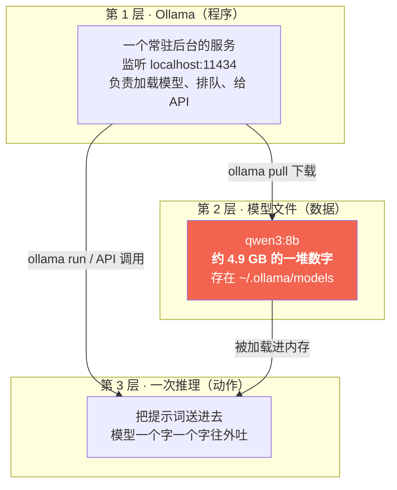
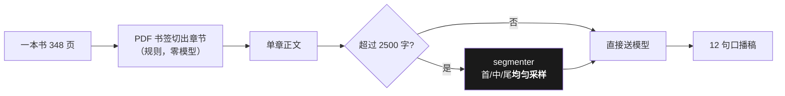
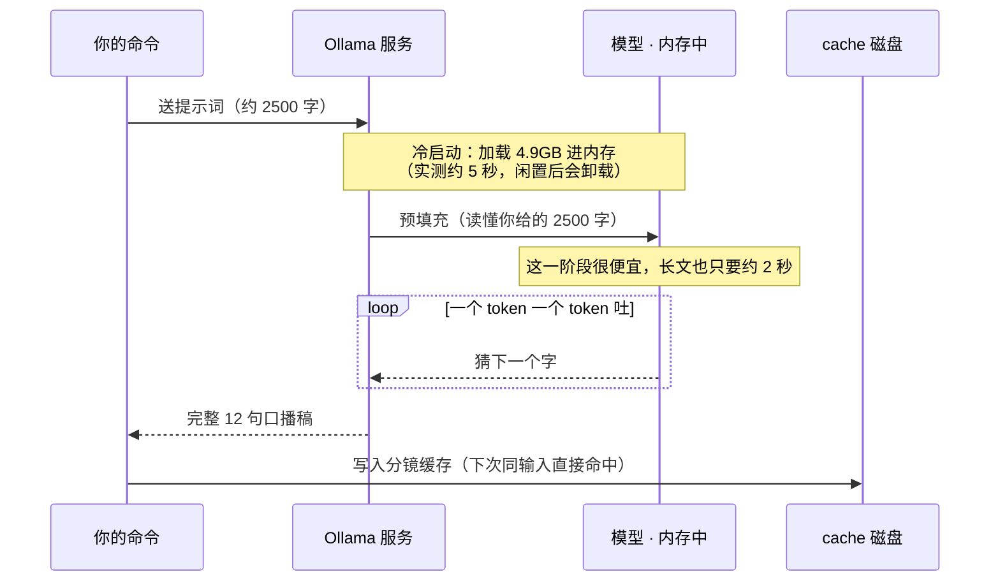

# 02 · 大模型与本地推理（你的电脑里到底在跑什么）

> 学完你能回答：**Ollama 和模型谁是谁？"8B""Q4""思考模式"都是啥？为什么我这台电脑能跑？**
> 跑一条命令感受一下：`ollama run qwen3:8b "用一句话解释什么是大模型"`

---

## 一、先分清三层（90% 的困惑都来自这三层被混着说）



**比喻**：Ollama 是**播放器**，模型文件是**电影文件**，推理是**正在播放**。
没装播放器放不了电影；装了播放器不下载电影也放不了。

所以看到这两句命令要能立刻分辨：

```bash
brew install ollama        # 装播放器（程序）
ollama pull qwen3:8b       # 下载电影（4.9 GB 数据）
```

> 常见误解：**"我装了 Ollama 为什么还跑不了？"** —— 因为你装了播放器，没下载电影。
> 反过来：**"我换了台电脑，模型还在吗？"** —— 不在，模型文件是数据，得重新 pull。

---

## 二、名字里的每个字都在说什么：`qwen3:8b`

| 片段 | 含义 | 为什么关心 |
|---|---|---|
| `qwen3` | 模型**家族**（通义千问第三代） | 不同家族指令跟随能力差很多 |
| `8b` | **80 亿参数** | 参数越多越聪明，也越吃内存 |
| `Q4_K_M`（量化标记） | 每个参数用 **4 bit** 存（原本 16 bit） | **这是本地能跑的关键**：压缩到 1/4，质量略降 |

**量化是什么**：把"用小数精确记录"改成"用整数粗略记录"。
就像把一张照片从 PNG 转成 JPG —— 体积小了 4 倍，肉眼几乎看不出差别。
**没有量化，8B 模型要 16 GB 内存，普通笔记本根本跑不动。**

---

## 三、token：模型不是按"字"收费的


- 中文大致 **1 个字 ≈ 1–1.5 个 token**（不是 1:1，但可以用这个估）。
- **模型本质上只干一件事：猜下一个 token。** 所谓"智能"是这个动作重复几千次后的涌现。
- 所以我们说"解码速率 14–17 tok/s"，等于**每秒吐十几个字** —— 这就是本地推理的硬速度上限。

### 上下文窗口：模型的"短期记忆"只有这么大

`config.yaml` 里有一行 `limits.max_chars: 2500`，注释写的是「4K ctx 硬约束」。

含义是：这个模型一次最多"看"约 4000 个 token。一本 348 页的书**塞不进去**。
所以本项目不是把整本书喂给模型，而是：



> ⚠️ 超长时**为什么是"均匀采样"而不是"截断开头"**：截开头等于默认"书的开头最重要"，
> 这个假设没有依据；均匀采样至少保证首尾中段都有代表。
> 这条判据由 `tests/verify_gate.py` 守着（含"正文章零误伤"断言）。

---

## 四、思考模式（`think`）：模型在回答前先打草稿

qwen3 有个开关：回答之前先输出一段"思考过程"（不给你看），再给正式答案。

| | 开思考 | 关思考 |
|---|---|---|
| 耗时 | 慢（约 2 倍） | **快约 2 倍** |
| 首字延迟 | 数十秒（要等它想完） | 亚秒 |
| 句子质量 | 通顺、语义完整 | **会碎**、语义可疑 |
| 适合 | 口播稿（要通顺） | 批量初筛（要快） |

对应到命令：`--fast` 就是临时关掉思考。

```bash
python -m book2vido run --input 书.pdf --chapter 8 --out out.mp4 --fast
```

**为什么要显式写在 `config.yaml`**：qwen3 在 Ollama 里默认就是开的，
不写 = **行为随模型版本漂移**，而你从代码里完全看不出来。
这类"看不见的默认值"是 AI 项目最常见的坑 —— 记住：**凡是影响结果的开关，都要显式写出来。**

> 完整实测对照（耗时 / token 数 / 思考字数）在
> [`../01-llm-local.md`](../01-llm-local.md) §性能实测，
> 复算命令：`python tools/bench_ollama.py --model qwen3:8b`。

---

## 五、为什么你的电脑能跑（硬件账）

一次真实推理的时序：



| 硬件项 | 8B Q4 模型的开销 | 16 GB 机器够不够 |
|---|---|---|
| 磁盘 | 约 4.9 GB（一次性） | 够 |
| 常驻内存 | 约 5.9 GB（跑的时候） | 够，但**别同时开第二个大模型** |
| 算力 | M1 Pro 的 GPU 全给它 | 够 |

> 冷启动为什么存在：模型闲着占 6 GB 太浪费，Ollama 会在闲置几分钟后把它**卸载**，
> 下次调用再付一次加载的钱（约 5 秒）。所以**批量跑最划算** —— 这笔钱只付一次。

---

## 六、本篇的一句话

> **本地推理不是"云端模型的低配版"，是另一种取舍**：
> 用「速度慢一点、质量差一点」换「零成本、零合规风险、断网也能跑」。

---

### 延伸阅读

- 选型对比与淘汰理由：[`../01-llm-local.md`](../01-llm-local.md)
- 换模型的完整 SOP：[`../../models/README.md`](../../models/README.md)
- 提示词怎么决定模型行为：[03 · 提示词即资产](03-提示词即资产.md)

**下一篇**：[03 · 提示词即资产](03-提示词即资产.md)
