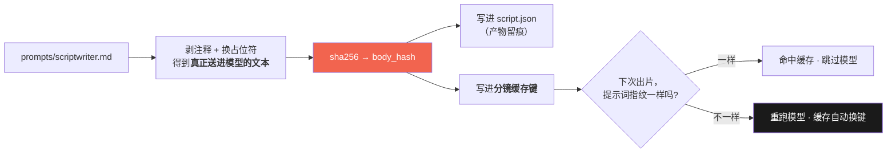
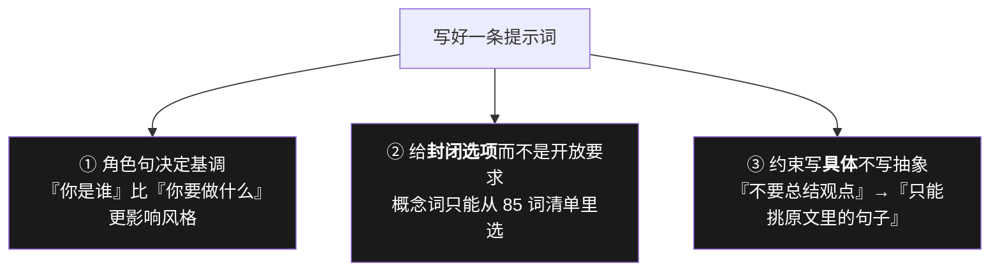

# 03 · 提示词即资产（为什么它不该住在代码里）

> 学完你能回答：**为什么一个"字符串"要单独存文件、带版本号、还算指纹？**
> 跑一条命令感受一下：`python tests/verify_prompt.py --show`

---

## 一、先看反例：提示词写在代码里会怎样

```python
# ❌ 曾经的写法（伪代码）
prompt = ("你是一个助手，请把下面的内容压成 " + str(n) + " 句口播。"
          "要求：不要总结观点，不要评论…")
```

三个代价，每一个都在本项目真实发生过：

| 代价 | 具体表现 |
|---|---|
| **改它要动代码** | 非程序员改不了；改完要走评审、要清 `__pycache__`（本项目为此踩过"跑了旧字节码"） |
| **注释无处安放** | 每条约束背后的实证理由只能另起一段 `#`，**离被说明的那行很远**，很快就没人维护 |
| **没有追溯** | 出片结果说不清"这版分镜是哪版提示词出的"，出了问题无法归因 |

---

## 二、本项目的做法：一份带注释、有版本、有指纹的文件

```
prompts/scriptwriter.md
├── frontmatter            id / version / applies_to / updated / placeholders（人读）
├── 文件头说明区            怎么读 / 怎么改 / 现在什么模型（不进模型）
├── <!-- @prompt:begin --> ─┐
│   提示词正文               │ ★ 真正送给模型的部分
│   <!-- 就近注释 -->        │ 加载时整块剥掉，不占 token
│   {{max_n}} 等占位符       │ 运行时替换
├── <!-- @prompt:end -->  ──┘
└── 人读区                  模型适配记录 / 改动影响面 / 验证 SOP（不进模型）
```

**就近注释**是这里最值钱的设计 —— 每条约束的"为什么"就写在它**旁边**：

```markdown
<!--
  ↑ 角色句。8B 级本地模型对「你是谁」很敏感：这一句决定它按「教科书摘要」
    还是「口播改写」来压。删掉或写弱会明显退化成书面摘要。
    属于高影响改动，动它请务必跑对照。
-->
你是一个把书/长文压成口播短视频脚本的助手。
```

> 这些注释**进了模型就是浪费 token 且污染行为**，所以加载器会把它们剥掉。
> 但**剥不剥得干净是有脚本守的** —— `tests/verify_prompt.py` 会抓出残留注释。
> 为什么需要脚本：写错了不报错，只是悄悄多烧 token。

---

## 三、指纹：改一个字就自动失效（不用记得升版本号）



**这是本篇最该记住的一点**：

> 缓存失效**不靠人记得升版本号**，靠**内容指纹**。
> `version: 1` 那个号是给人读的追溯标签，**不是**失效开关 ——
> 靠人记得升版本号，迟早会忘一次（然后你会花两小时查"为什么改了没生效"）。

对应到这条命令（改完提示词必跑）：

```bash
python tests/verify_prompt.py          # 与 golden 基准逐字节比对；不一致 → 退出码 1
python tests/verify_prompt.py --show   # 打印当前真正送进模型的文本
python tests/verify_prompt.py --update # **有意改动**后，把当前渲染结果存为新基准
```

> ⚠️ `--update` 会掩盖意外改动。用完之后请 `git diff tests/prompt_golden.txt` **人肉看一眼**。

---

## 四、提示词工程的三条经验（本项目实证）



| 经验 | 为什么 |
|---|---|
| **角色句优先** | 8B 级小模型对"你是谁"极度敏感。写成"你是一个助手" → 退化成教科书摘要 |
| **给封闭选项** | 让它"自由发挥配个图标"会得到一千种写法、无法缓存也无法画；给 85 个词的固定清单 → 输出稳定、画面可画 |
| **约束具体化** | "不要总结观点"是抽象的，模型不知道什么叫观点；"只能挑原文里已有的句子"是可执行的 |

第三条直接对应本项目的**铁律九（思想的搬运工）**：
**我们只换载体，不造思想** —— 模型只决定"怎么呈现"，不决定"说什么"。
提示词里那条"不总结、不评论、不改写"就是这条铁律的落地处。

---

## 五、想试另一版提示词？不用改仓库文件

```yaml
# config.yaml
llm:
  prompt_file: /path/to/我的实验版.md   # 指过去即可，不动仓库里的正式版
```

改了会：①自动让分镜缓存失效 ②产物 `script.json` 里记下 `prompt_version` / `prompt_hash`。

---

## 六、本篇的一句话

> **提示词是"给模型的源代码"** —— 那就该像源代码一样有版本、有注释、有评审、有回归测试。

---

### 延伸阅读

- 提示词文件本体（带全部就近注释）：[`../../prompts/scriptwriter.md`](../../prompts/scriptwriter.md)
- 换模型时提示词怎么改：[`../15-提示词与模型适配.md`](../15-提示词与模型适配.md)
- 缓存为什么这么分层：[04 · 确定性与缓存](04-确定性与缓存.md)

**下一篇**：[04 · 确定性与缓存](04-确定性与缓存.md)
