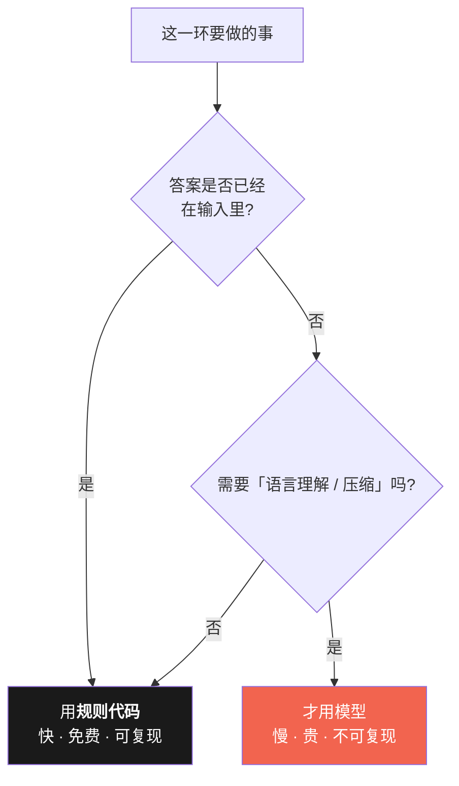
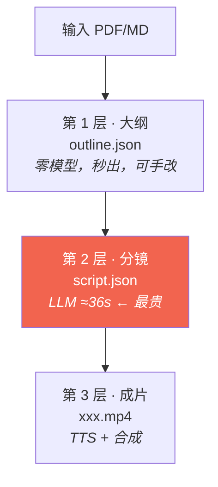
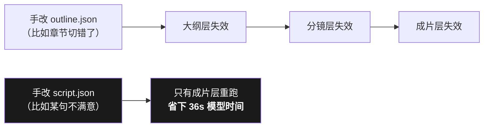

# 04 · 确定性与缓存（AI 项目最反直觉的一课）

> 学完你能回答：**为什么这个号称"AI 项目"的东西，7 个环节里只有 1 个用 AI？**
> 跑一条命令感受一下：连续跑两次同一章，第二次的耗时会让你怀疑它没干活。

---

## 一、反直觉的结论：能不用 AI 的地方，就别用 AI



本项目的 7 个环节，逐个过一遍这个决策树：

| 环节 | 答案在输入里吗？ | 用什么 | 为什么 |
|---|:-:|---|---|
| 文本抽取 | ✅ | pypdf | PDF 里本来就有文字，不需要"理解" |
| 目录索引 | ✅ | PDF 书签 | 书里自带目录，**零幻觉** |
| 分镜 / 口播稿 | ❌ | **LLM** | 只有"压成能口播的话"需要语言能力 |
| 画面 | ✅ | Pillow + 图标 | 概念词已定，画图是确定性的 |
| 配音 | ✅ | TTS | 文字→语音，不需要理解 |
| 合成 | ✅ | FFmpeg | 纯编解码 |
| 发布 | ✅ | 脚本 | 纯流程 |

**结论：7 格里只有 1 格用模型。** 这条写进了宪法（铁律六）。

### 为什么这不只是省钱

| 收益 | 说明 |
|---|---|
| **可复现** | 规则代码同样的输入永远出同样的输出；模型不一定 —— 不可复现 = 不能缓存 = 不能回归测试 |
| **可缓存** | 确定性的环节可以大胆缓存，只有分镜那格需要小心 |
| **可排查** | 出问题时能二分定位；如果 7 格全是模型，你只能祈祷 |
| **实测占比** | 分镜一格占总耗时 **65%** —— 它就是唯一值得优化的地方 |

> 实测与剖析命令：`python tools/profile_pipeline.py --config config.yaml`
> ⚠️ **必须显式传 `--config`**：`config.load()` 默认不读 `config.yaml`，
> 会静默降级成 `rule` provider（无模型），表现为"分镜 0.02 秒就出来了"。
> 这个坑本项目踩过不止一次。

---

## 二、三层缓存：把"不确定"隔离在最小范围



**每一层的缓存键挂的东西不一样** —— 这是设计的核心：

| 层 | 缓存键包含 | 改什么会失效 |
|---|---|---|
| 大纲 | 文件指纹 | 换了输入文件 |
| 分镜 | 文件 + 章节 + **模型** + **提示词指纹** + think | 换模型 / 改提示词**一个字** / 开关思考 |
| 成片 | 分镜键 + **配色主题** + 尺寸 + 配音音色 … | 换主题 / 改分辨率 / 换音色 |

**关键洞察**：键挂的是「影响这一层输出的所有变量」，一个不多一个不少。

- 改配色**不会**让分镜重算（省 36 秒）—— 因为配色不影响分镜。
- 改提示词**会**让分镜重算 —— 因为它直接决定分镜。

> 反过来就是两类 bug：
> ①**该失效没失效** → "改了像没改"（本项目真实发生过：成片缓存键一度漏了 `theme`）；
> ②**不该失效却失效** → 每次都重跑，白等 36 秒。
> 两种都不报错，只能靠 `tests/verify_cache.py` 守。

---

## 三、命中缓存是什么体验

同一章跑两次：

| | 第一次 | 第二次 |
|---|---|---|
| 分镜 | 跑模型，约 36 s | **缓存命中，跳过** |
| 成片 | TTS + 合成 | **缓存命中，直接返回** |
| 墙钟 | 约 90 s | **约 1 s** |

```bash
$ python -m book2vido run --input 书.pdf --chapter 3 --out out.mp4
    · 分镜：缓存命中 12 句（跳过模型，省 ~36s）
    · 成片：缓存命中 → out.mp4
=== book2vido 成本日志（零公司资源）===
耗时      : 0.0 s
缓存      : hit
```

### 手改中间产物：只重跑下游

`outline.json` 和 `script.json` 都是**人可读、可手改**的。



**这就是为什么要分层**：让你能在"最便宜的那一层"介入修改。
不满意一句话，改 `script.json` 就行，**不用重新跑模型**。

---

## 四、本篇的一句话

> **AI 项目的专业度，不看你用了多少 AI，看你在多少地方克制住了不用。**

---

### 延伸阅读

- 判据（歧义在哪一侧）· 7 环节分工表 · 缓存失效键全表：[`../13-确定性与模型分工.html`](../13-确定性与模型分工.html)
- 缓存行为的机器守护：[`../../tests/README.md`](../../tests/README.md)
- 改了没生效？先看是不是没传 `--config`：[`../lessons/README.md`](../lessons/README.md)

**下一篇**：[05 · 动手实验](05-动手实验.md)
