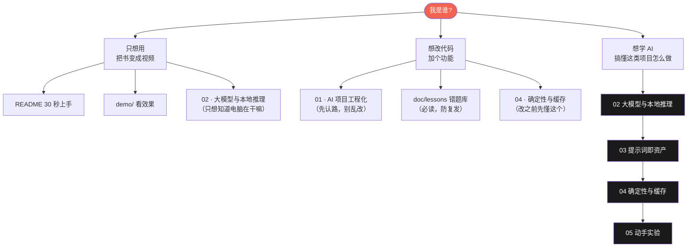

# 学 AI · 学习中心

> **这个仓库是 AI 写出来的，但它不该因此变成一本读不懂的天书。**
> 这里把 book2vido 拆成一条**能学完的路**：每一篇回答一个"为什么"，
> 配一张图，附一条**你现在就能跑**的命令。
>
> 目标读者：**想搞懂 AI 项目到底怎么回事的人**（不需要深度学习背景，会跑命令行就行）。

---

## 与 `doc/` 的分工（重要，别搞混）

| 目录 | 回答什么 | 面向 | 写法 |
|---|---|---|---|
| **`doc/learn/`**（这里） | **"这是怎么回事、我怎么学会"** | **想学的人** | 比喻 + 图 + 能跑的命令，**不产出新决策** |
| [`../`](../README.md) 上层的 `doc/` | "我们选了什么、为什么、代价是什么" | 维护者 | 选型 / 决策 / 踩坑，是**结论的产地** |

**所以这里不写新结论，只把已有结论讲成人话。** 想改结论去 `doc/`；改完回来看看这里有没有讲错。

---

## 三条路（挑一条，不用全读）



---

## 课程表

| # | 篇目 | 学完你能回答 | 关键图 |
|:-:|---|---|---|
| 01 | [AI 项目长什么样](01-AI项目工程化.md) | 为什么要有 `src/` `tests/` `models/` `logs/` 这些分区？AI 项目跟普通项目差在哪？ | 分层图 · 数据流 |
| 02 | [大模型与本地推理](02-大模型与本地推理.md) | Ollama 和模型谁是谁？什么叫"8B""Q4""思考模式"？为什么我的电脑能跑？ | 三层关系图 · 推理时序 |
| 03 | [提示词即资产](03-提示词即资产.md) | 为什么提示词要单独存一个文件、还要有版本号和指纹？ | 提示词生命周期 |
| 04 | [确定性与缓存](04-确定性与缓存.md) | 为什么**能不用 AI 的地方就别用 AI**？改一个字缓存为什么整个失效？ | 决策树 · 缓存分层 |
| 05 | [动手实验](05-动手实验.md) | 6 个能跑的实验，做完你对整条链路就不再是"听说过" | 实验流程图 |

---

## 这一路会反复出现的四句话

1. **能用规则就别用模型。** 模型是这条链路上唯一不可复现、最贵、最难查的一环。
2. **提示词不是字符串，是资产。** 它有版本、有指纹、改一个字就会让下游缓存失效。
3. **本机测不出来的，才是要写脚本守住的。** 有网时一切正常，用户断网才发现挂了。
4. **对外说的每个数字，都要能回挂一条命令。** 说不出命令，就别说数字。

> 这四句不是口号，每一句背后都是本项目踩过的具体坑 —— 在
> [`../lessons/README.md`](../lessons/README.md)（错题库）里都能找到对应条目。

---

## 读之前：三条环境准备

```bash
# ① 本地模型（只需一次，约 4.9 GB）
brew install ollama && ollama pull qwen3:8b

# ② 合成与图标工具链
brew install ffmpeg librsvg

# ③ 本项目（可编辑安装）
python3 -m venv .venv && source .venv/bin/activate && pip install -e .
```

跑不起来先别硬啃文档 —— 先跑 [`demo/`](../../demo/README.md) 看它到底产出什么，
有了"哦，原来是这样一条视频"的直觉，再回来看原理会快三倍。
