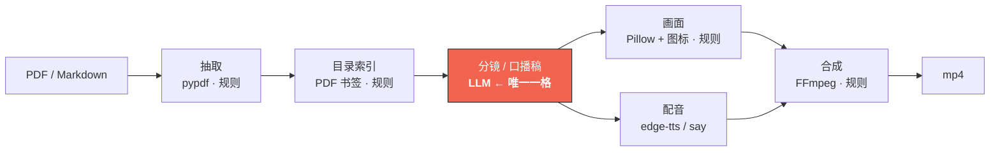
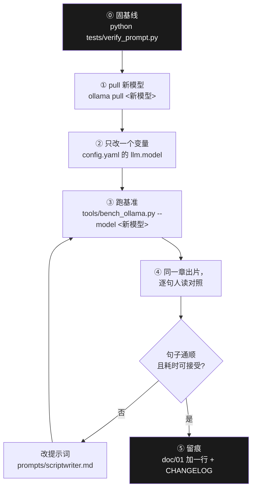
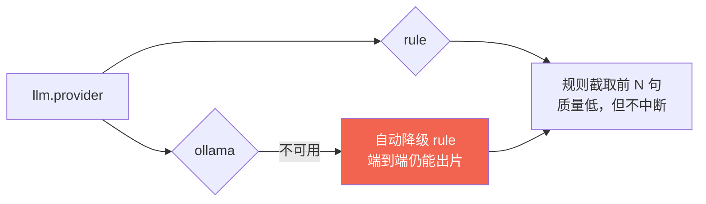

# models/ · 大模型管理（台账 + 换模型 SOP）

> ⚠️ **这里一个模型文件都没有。** 本目录是**「用哪个模型、怎么换、换完怎么验」**的台账，
> 模型权重在 `~/.ollama/models`（Ollama 管），不在仓库里 —— 几个 GB 量级，也不该进 git。
>
> 与 `src/book2vido/models.py` 是**两回事**：那个是数据结构契约（`Scene` / `ScriptDoc`），
> 这个是模型资产管理。同名不同层，别混。
>
> 📌 **「本机实际装了哪几个模型、多大、还能不能加」不在这里** ——
> 那是环境类事实，唯一来源是 [`doc/26-本机环境实况.md`](../doc/26-本机环境实况.md)。
> 本文件只讲**流程**，不讲本机此刻的状态。

---

## 一、模型在这条链路上的位置（只有一格用模型）

**铁律六**：7 个环节里只有「分镜」用模型，其余全是可确定的规则代码。
这条不是洁癖，是**成本与确定性的选择** —— 实测 LLM 分镜占总耗时 **65%**，
多一格用模型就多一格不可复现、多一格要缓存、多一格会漂移。

> 口径与实测基线：[`../doc/23-研究级架构评审.html`](../doc/23-研究级架构评审.html)
> （环节耗时剖析用 `python tools/profile_pipeline.py --config config.yaml` 复算）。

---

## 二、当前在用（唯一事实源在 `config.yaml`，此处只做台账）

| 项 | 值 | 事实源 |
|---|---|---|
| provider | `ollama` | `config.yaml` → `llm.provider` |
| model | `qwen3:8b` | `config.yaml` → `llm.model` |
| think | `true`（**必须显式写**） | `config.yaml` → `llm.think` |
| 提示词 | `prompts/scriptwriter.md` | `config.yaml` → `llm.prompt_file`（`null` = 默认那个） |

**本文件不复制这些值** —— 抄一份就多一个会漂移的副本。要看现在真正在用什么，读 `config.yaml`；
要看本机**装了什么**。跑 `python tests/verify_env.py` 或读 `doc/26`。

> ⚠️ **容易踩的认知偏差**：本机**只装了 `qwen3:8b` 一个模型**，没有 Llama、也没有 3B 档。
> 「以为有备选」在真出事时才发现没有 —— 备份模型要**主动 pull** 才会存在（doc/26 §四）。

### 实测对照：8B vs 0.6B（2026-09-19，同一素材、只改 `llm.model`）

复算：`python tools/bench_model_compare.py --input <素材> --models qwen3:8b,qwen3:0.6b`

| | `qwen3:8b` | `qwen3:0.6b` |
|---|---|---|
| 分镜耗时 | 51.9 s | **29.2 s**（约 1.8x 快） |
| 端到端出片（同一素材） | 63.5 s | **14.2 s**（约 4.5x 快） |
| 句数 | 12 | 11 |
| **句子质量** | 信息完整 | **明显退化**，见下 |

**为什么仍然不用 0.6B 跑主链路** —— 不是它慢，是它会**改事实**：

| 素材原文 | 8B 出的句子 | 0.6B 出的句子 |
|---|---|---|
| 「是逼近，不是反超」(95% vs 100%) | 「开源版未反超原版仅逼近95%」 ✅ | 「**比原版100%更快**」 ❌ **事实反转** |
| 融资 / 创始人 | （信息完整） | 「公司融资，创始人创新」❌ 空洞无信息 |
| 延迟数据 | 「延迟70-500毫秒比对话模型快193倍」 | 「延迟数据，对比其他模型」❌ 占位符式空句 |

这条直接撞在**项目定位**上：我们的承诺是「**只换载体、不造思想**」（思想的搬运工）。
小模型在压缩时会**把素材特意纠正过的结论重新搞反** —— 这不是质量降级，是**产出物不再忠于原文**。

> 附带发现：同一素材连跑两次，两版的句子**不一样**（生成非确定性）。
> 对这个项目来说，"同一输入出不同句子"本身就是代价 —— 见 `doc/13-确定性与模型分工.html`。

**可用之处**：批量**初筛**（先看哪些章节值得出片），人复核过再正式出片。
这与 `--fast`（关思考）同类：**它能省的是"先看一眼"的钱，不是"最终成品"的钱。**

### 为什么是 Qwen3-8B

| 判据 | 结论 |
|---|---|
| 任务难度 | 「把长文压成能口播的 12 句」是**中等难度**，8B 够用，不需要追 SOTA |
| 硬件 | M1 Pro 16GB 可跑（常驻约 5.9 GB，占 1/3 内存） |
| 成本 | 电费，无按次计费 |
| 合规 | **铁律一**：零公司资源。本地模型天然满足 |
| 断网 | 本地推理 → 铁律九「断网跑得完」成立 |

完整选型对比（含 14B / 1.3B / FreeToken 等备选与淘汰理由）：
[`../doc/01-llm-local.md`](../doc/01-llm-local.md)。

### 实测性能（不复述数字，只给复算命令）

| 想知道 | 命令 | 结果落在 |
|---|---|---|
| 解码速率 / 冷启动 / 首字延迟 / 思考开销 | `python tools/bench_ollama.py --model qwen3:8b` | 终端 + `/tmp/ollama_bench.json` |
| 各环节耗时占比 | `python tools/profile_pipeline.py --config config.yaml` | 终端 |
| 断网是否真断 | `python tests/verify_offline.py --tts say` | 终端（**外网请求须为 0**） |

> ⚠️ 写文档时**不要把这些数字抄进来** —— 抄进来那一刻就开始过期。
> 要引用就写「实测值 + 复算命令」。本项目已因此踩过三次（错题库 L-12 / L-14 / L-18）。

---

## 三、换模型五步（照做，别跳步）

1. **⓪ 先固基线**：`python tests/verify_prompt.py` 必须是绿的。
   不固基线，后面出任何变化你都分不清是**模型的锅还是提示词的锅**。
2. **① 拉模型**：`ollama pull qwen3:14b`（举例）。先看磁盘：14B 约 9 GB ——
   **本机能不能塞下、值不值得，先查 [`doc/26`](../doc/26-本机环境实况.md) §五的可行性表**
   （16 GB 机器上 14B 会卡，建议先拉 4b 档做对照）。
3. **② 一次只改一个变量**：只动 `llm.model`。**不要同时改 `think` 和 `prompt_file`**
   —— 改三个变量得到"变好了"，你不知道是哪个起的作用。
4. **③ 量一遍**：`python tools/bench_ollama.py --model <新模型>`，与旧模型对照。
5. **④ 人读**：同一章出片，**逐句读**。这一步没有自动化替代 —— 通顺与否是人的判断。
6. **⑤ 留痕**：把结论写进 [`../doc/01-llm-local.md`](../doc/01-llm-local.md) 的实测表 + `CHANGELOG.md`。

> 提示词要跟着改时的完整方法论（frontmatter / 就近注释 / 指纹 / 缓存失效）：
> [`../doc/15-提示词与模型适配.md`](../doc/15-提示词与模型适配.md)。

### 换模型的隐藏成本（先算再换）

| 成本 | 说明 |
|---|---|
| 分镜缓存全失效 | 缓存键含 model → 换模型 = 之前所有分镜重算（约 36 s/章） |
| 提示词可能要重写 | 不同模型的指令跟随差异很大，尤其 JSON 约束与句数控制 |
| 常驻内存 | 8B ≈ 5.9 GB → 14B ≈ 9 GB，16 GB 机器上会明显卡 |
| 冷启动 | 每次闲置后重新加载（8B 实测约 4.9 s），批量跑时这笔钱只付一次 |

---

## 四、没有模型时的降级路径

`llm.provider` 可填 `rule`：不调模型，按规则截取前 N 句当口播稿。

**这是刻意的**：宁可出一版质量低的片，也不在用户面前崩。
但降级是**兜底不是常态** —— 判断依据：`config.load()` **默认不读 `config.yaml`**，
`DEFAULT` 里的 provider 就是 `rule`。所以**脚本里忘了显式传 `--config` 会静默走 rule**，
表现为"分镜 0.02 秒就出来了"（正常要 36 秒）。这个坑已复现多次，
排查第一反应应该是：**是不是没传 `--config`**。

---

## 五、红线

- ❌ **禁用一切公司订阅的 LLM / API key**（`CONSTITUTION.md` 铁律一）。
  包括"只是试试效果""只是对比一下质量" —— 收益是省一次本地推理，代价是合规。
- ❌ 不要把模型权重提交进仓库（4.9 GB，且许可各不同）。
- ❌ 不要在这里复制 `config.yaml` 里已有的值，也不要复制 `doc/01` 里已有的实测数字，
  更不要复制 `doc/26` 里的本机环境数字（装了什么、多大、在哪）。
  **台账的价值在于指得准，不在于写得全。**
